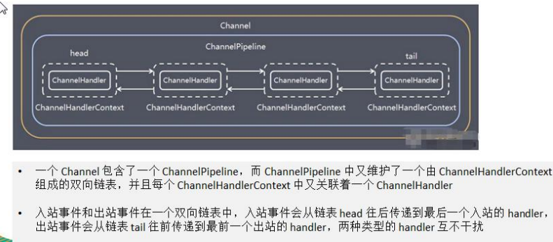
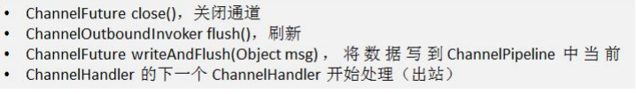
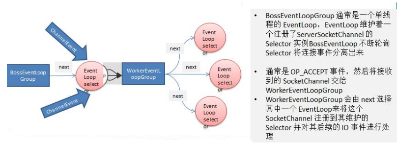
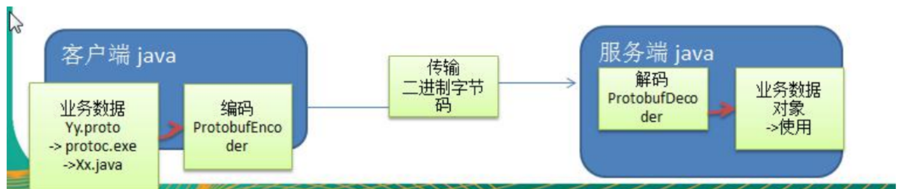
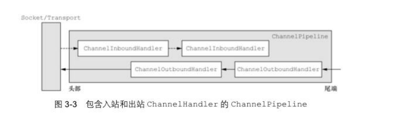
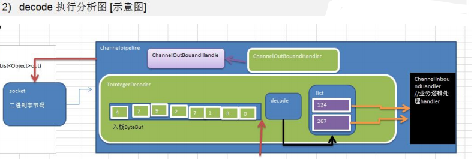
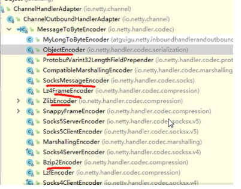

# 一、Netty的概念与体系结构

## 1、Netty介绍

### 1.1、简介

Netty是由JBOSS提供的一个java开源框架，现为Github上的独立项目

Netty是一个异步的，基于事件驱动的网络应用框架，用以快速开发性能、高可靠性的网络IO程序。

Netty主要针对在TCP协议下，面向Clients端的高并发应用，或者Peer-to-Peer场景下的大量数据持续传输的应用。

Netty本质是一个NIO框架，适用于服务器通讯相关的多种应用场景

#### 1.2、特点

##### 设计

- 统一的API，支持多种传输类型，阻塞和非阻塞的
- 简单而强大的线程模型
- 真正的无连接数据套接字（socket的原意是“插座”，在计算机通信领域，socket被翻译为"套接字"）支持
- 链接逻辑组件以支持复用

##### 易于使用

- 详实的Javadoc和大量的示例集
- 不需要超过JDK1.6+的依赖。

##### 性能

- 拥有比Java的核心API更高的吞吐量以及更低的延迟
- 得益于池化和复用，拥有更低的资源消耗
- 最少的内存复制

##### 健壮性

- 不会因为慢速、快速或者超载的连接而导致OutOfMemoryError
- 消除在高速网络中NIO应用程序常见的不公平读/写比率

##### 安全性

- 完整的SSL/TLS以及StartTLS支持
- 可用于受限环境下，如Applet和OSGI

##### 社区驱动

- 发布快速而且频繁

### 1.3、异步与事件驱动

一个既是异步的又是事件驱动的系统会表现出一种特殊的、对我们来说极具价值的行为：它可以以任意的顺序响应在任意的时间点产生的事件。

这种能力对于实现最高级别的可伸缩性至关重要，定义为：“一种系统、网络或者进程在需要处理的工作不断增长时，可以通过某种可行的方式或者扩大它的处理能力来适应这种增长的能力。”

异步和可伸缩性之间的联系又是什么呢？

- 非阻塞网络调用使得我们可以不必等待一个操作的完成。完全异步的 I/O 正是基于这个特性构建的，并且更进一步：异步方法会立即返回，并且在它完成时，会直接或者在稍后的某个时间点通知用户。
- 选择器使得我们能够通过较少的线程便可监视许多连接上的事件。

将这些元素结合在一起，与使用阻塞 I/O 来处理大量事件相比，使用非阻塞 I/O 来处理更快速、更经济。从网络编程的角度来看，这是构建我们理想系统的关键，而且你会看到，这也是Netty 的设计底蕴的关键。

### 1.4、核心组件

#### 1.4.1、Channel

channel是Java NIO的一个基本构造。

它代表一个实体（如一个硬件设备、一个文件、一个网络套接字或者一个能够执行一个或者多个不同的I/O操作的程序组件）的开放连接，如读操作和写操作。

目前，可以把Channel看做是传入（入站）或者传出（出站）数据的载体。因此，它可以被打开或者被关闭，连接或者断开连接。

#### 1.4.2、回调

一个回调其实就是一个方法，一个指向已经被提供给另外一个方法的方法的引用。这使得后者可以在适当的时候调用前者。回调在广泛的编程场景中都有应用，而且也是在操作完成后通知相关方最常见的方式之一。

Netty在内部使用了回调来处理事件；当一个回调被触发时，相关的事件可以被一个Interface-channelHandler的实现处理。当一个新的连接已经被建立时，ChannelHandler 的 channelActive()回调方法将会被调用，并将打印出一条信息。

```java
public class ConnectHandler extends ChannelInboundHandlerAdapter{
    /**
        当一个新的连接已经建立时，channelActive(ChannelHandlerContext)将会被调用
    **/
    @Override
    public void channelActive(ChannelHandlerContext ctx) throws Exception{
        System.out.println("Client"+ctx.channel()+remoteAddress()+"connected");
    }
}
```

#### 1.4.3、Future

Future提供了另一种在操作完成时通知应用程序的方式。这个对象可以看作一个异步操作的结果的占位符；它将在未来的某个时刻完成，并提供对其结果的访问。

JDK预置了interface java.util.concurrent.Future,但是其提供的实现，只允许手动检查对应的操作是否已经完成，或者一直阻塞直到它完成，这是非常繁琐的，所以Netty提供了它自己的实现——ChannelFuture，用于执行异步操作的时候使用。

ChannelFuture提供了几种额外的方法，这些方法使得我们能够注册一个或者多个ChannelFutureListener实例。监听器的回调方法operationComplete(),将会在对应的操作完成时被调用（如果在 ChannelFutureListener 添加到 ChannelFuture 的时候，ChannelFuture 已经完成，那么该 ChannelFutureListener 将会被直接地知）。然后监听器可以判断该操作是成功地完成了还是出错了。如果是后者,我们可以检索产生的Throwable。简而言之，由ChannelFutureListener提供的通知机制消除了手动检查对应的操作是否完成的必要。

每个Netty的出站I/O操作都将返回一个ChannelFuture；也就是说，它们都不会阻塞。Netty完全是异步和事件驱动的。

```java
//异步的建立连接
Channel channel =...;
//Does not block
//异步地连接到远程节点。
//connect()方法会直接返回，不会阻塞，该调用将会在后台完成。
//也就是说可以去别的事，而不是等待。
ChannelFuture future = channel.connect(new InetSockAddress("192.168.0.1",25));
//异步的建立连接
Channel channel =...;
ChannelFuture future = channel.connect(new InetSockerAddress("192.168.0.1",25));
//注册一个channelFutureListener以便在操作完成时获得通知
future.addListener(new ChannelFutureListener(){
    @Override
    public void operationComplete(ChannelFuture future){
        //检查操作状态。
        if(future.isSuccess()){
            //如果操作是成功的，则创建一个ByteBuf以持有数据。
            ByteBuf buffer = Unpooled.copiedBuffer("Hello",Charset.defaultCharset());
            //将数据异步地发送到远程节点，返回一个channelFuture
            ChannelFuture wf = future.channel().writeAndFlush(buffer);
        }else{
            //如果发送错误，则访问描述错误原因的Throwable
            //可以重新连接或者建立一个到另一个远程节点的连接，这里仅输出了错误原因。
            Throwable cause = future.cause();
            cause.printStackTrace();
        }
    }
})
```

#### 1.4.4、事件和channelHandler

Netty使用不同的事件来通知我们状态的改变或者操作的状态。使得我们能够基于已经发送的事件来触发适当的动作。这些动作可能是

- 记录日志；
- 数据转换；
- 流控制；
- 应用程序逻辑。

Netty是一个网络编程框架，所有事件是按照它们入站或出站数据流的相关性进行分类。可以由入站数据或者相关的状态改变而触发的事件包括：

- 连接已被激活或者连接失活；
- 数据读取；
- 用户事情；
- 错误事件。

出站事件是未来将会触发的某个动作的操作结果，这些动作包括：

- 打开或者关闭到远程节点的连接；
- 将数据写到或者冲刷到套接字。

每个事件都可以被分发给channelHandler类中的某个用户实现的方法。

Netty 的 ChannelHandler 为处理器提供了基本的抽象，如图 1-3 所示的那些。我们会在适当的时候对 ChannelHandler 进行更多的说明，但是目前你可以认为每个 ChannelHandler 的实例都类似于一种为了响应特定事件而被执行的回调。

Netty 提供了大量预定义的可以开箱即用的 ChannelHandler 实现，包括用于各种协议（如 HTTP 和 SSL/TLS）的 ChannelHandler。在内部，ChannelHandler 自己也使用了事件和 Future，使得它们也成为了你的应用程序将使用的相同抽象的消费者。


#### 1.4.5、总结

##### 1、Future、回调和ChannelHandler

Netty的异步编程模型是建立在Future和回调的概念之上的，而将事件派发到ChannelHandler的方法则发生在更深的层次上。结合在一起，这些元素就提供了一个处理环境，使你的应用程序逻辑可以独立于任何网络操作相关的顾虑而独立地演变。

这也是 Netty 的设计方式的一个关键目标。拦截操作以及高速地转换入站数据和出站数据，都只需要你提供回调或者利用操作所返回的Future。这使得链接操作变得既简单又高效，并且促进了可重用的通用代码的编写。

##### 2、选择器、事件和EventLoop

Netty通过触发事件将Selector从应用程序中抽象出来，消除了所有本来将需要手动编写的派发代码。在内部，将会为每个channel分配一个EventLoop,用以处理所有事件，包括：

- 注册感兴趣的事件；
- 将事件派发给ChannelHandler
- 安排进一步的动作。

EventLoop本身只由一个线程驱动，其处理了一个Channel的所有I/O事件，并且在该EventLoop的整个生命周期内都不会改变。这个简单而强大的设计消除了ChannelHandler实现中需要进行同步的任何顾虑。

# 二、java BIO 编程

## 2.1、I/O模型

1. I/O模型简单的理解；就是用什么的通道进行数据的发送和接收，很大程度上决定了程序通信的性能

2. Java共支持3种网络编程模型I/O模式：BIO，NIO，AIO

3. Java BIO ：同步并阻塞（传统阻塞型），服务器实现模式为一个连接一个线程，即客户端有连接请求时服务器端就需要启动一个线程进程处理，如果这个连接不做任何事情会造成不必要的线程开销

   

4. Java NIO同步非阻塞，服务器实现模式为一个线程处理多个请求（连接），即客户端发送的连接请求都会注册到多路复用器上，多路复用器轮询到连接有I/O请求就进行处理

   

5. Java AIO（NIO 2）异步非阻塞，AIO引入异步通道的概念，采用了Proactor模式。简化了程序编写，有效的请求才能启动线程，它的特点是由操作系统完成后才通知服务端程序启动线程去处理，一般适用于连接数较多且连接时间较长的应用

## 2.2、BIO、NIO、AIO适用场景

1. BIO方式适用于连接数目比较小且固定的架构，这种方式对服务器资源要求比较高，并发局限于应用中，JDK1.4以前的唯一选择，但程序程序简单易理解
2. NIO方式适用于连接数目多且连接比较短（轻操作）的架构，比如聊天服务器，弹幕系统，服务器间通讯等。编程比较复杂，JDK1.4开始支持。
3. AIO方式使用于连接数目多且连接比较长（重操作）的架构，比如相册服务器，充分调用OS参与并发操作，编程比较复杂，JDK7开始支持。

## 2.3、Java BIO 基本介绍

1. Java BIO就是传统的java io编程，其相关的类和接口在java.io
2. BIO(blocking I/O)：同步阻塞，服务器实现模式为一个连接一个线程，即客户端有连接请求时服务器端就需要启动一个线程进行处理，如果这个连接不做任何事情会造成不必要的线程开销，可以通过线程池机制改善，
3. BIO方式适用于连接数目比较小且固定的架构，这种方式对服务器资源要求比较高，并发局限于应用中，JDK1.4以前的唯一选择，程序简单易理解，

## 2.4、Java BIO 工作机制


**对BIO编程流程的梳理**

- 服务器端启动一个ServerSocket
- 客户端启动Socket对服务器进行通信，默认情况下服务器端需要对每个客户，建立一个线程与之通讯
- 客户端发出请求后，先咨询服务器是否有线程响应，如果没有则会等待，或者被拒绝
- 如果有响应，客户端线程会等待请求结束后，在继续执行

## 2.5、Java BIO应用实例

**PS**：

1. 使用BIO模型编写一个服务器端，监听6666端口，当有客户端连接时，就启动一个线程与之通讯。
2. 要求使用线程池机制改善，可以连接多个客户端。
3. 服务器端可以接收客户端发送的数据（telnet方式即可）

```java
package com.netty.bio;

import java.io.IOException;
import java.io.InputStream;
import java.net.ServerSocket;
import java.net.Socket;
import java.util.concurrent.ExecutorService;
import java.util.concurrent.Executors;

public class BIOServer {

    public static void main(String[] args) throws IOException {
        //线程池机制
        //思路
        //1.创建一个线程池
        //2.如果有客户端连接，就创建一个线程，与之通讯
        ExecutorService newCachedThreadPool = Executors.newCachedThreadPool();
        ServerSocket serverSocket = new ServerSocket(6666);
        System.out.println("服务器启动");
        while(true){
            //监听，等待客户端；连接
            final Socket socket= serverSocket.accept();
            System.out.println("连接到一个客户端");
            //就创建一个线程，与之通讯（单独写一个方法）
            newCachedThreadPool.execute(new Runnable() {
                @Override
                public void run() {
                    //可以和客户端通讯
                    handler(socket);
                }
            });

        }

    }

    //编写一个handler方法，和客户端通讯
    public static void handler(Socket socket){
        try {
            byte[] bytes = new byte[1024];
            //通过socket获取输入流
            InputStream inputStream = socket.getInputStream();
            //循环的读取客户端发送的数据
            while (true){
                int read = inputStream.read(bytes);
                if (read!=1){
                    System.out.println(new String(bytes,0,read));
                }else {
                    break;
                }
            }

        } catch (IOException e) {
            e.printStackTrace();
        }finally {
            System.out.println("关闭和client的连接");
            try {
                socket.close();
            } catch (IOException e) {
                e.printStackTrace();
            }
        }
    }
}
```

# 三、Java NIO 编程

## 3.1、Java NIO 基本介绍

1. Java NIO 全称java non-blocking IO，是指JDK提供的新API。从JDK1.4开始，Java提供了一系列改进的输入/输出的新特性，被统称为NIO（即New IO），是同步非阻塞的

2. NIO相关类都被放在java.nio包及子包下，并且对原java.io包中的很多类进行改写。

3. NIO有三大核心部分：**Channel（通道），Buffer（缓存区），Selector（选择器）**

4. NIO是面向**缓冲区，或者面向块编程的**，数据读取到一个它稍后处理的缓冲区，需要时可在缓冲区中前后移动，这就增加了处理过程中的灵活性，使用它可以提供非阻塞式的高伸缩性网络

5. Java NIO的非阻塞模式，使一个线程从某通道发送请求或者读取数据，但是它仅能得到目前可用的数据，如果目前没有数据可用时，就什么都不会获取。而不是保持线程阻塞，所以直至数据变得可以读取之前，该线程可以继续做其他的事情。非阻塞写也是如此，一个线程请求写入一些数据到某通道，但不需要等待它完成写入。这个线程同时可以去做别的事情。

6. 通俗理解：NIO是可以做到用一个线程来处理多个操作的。假设有10000个请求过来，根据实际情况，可以分配50个或者100个线程来处理。不像之前的阻塞IO那样，非得分配10000个。

7. HTTP 2.0 使用了多路复用的技术，做到同一个连接并发处理多个请求，而且并发请求的数量比HTTP 1.1大

8. 实例说明NIO的Buffer
   
   ```java
   package com.netty.nio;
   
   import java.nio.IntBuffer;
   
   public class BasicBuffer {
     public static void main(String[] args) {
         //举例说明Buffer的使用（简单说明）
         //创建一个Buffer，大小为5，即可以存放5个int
         IntBuffer intBuffer = IntBuffer.allocate(5);
         //向buffer 存放数据
        for (int i=0;i< intBuffer.capacity();i++){
            intBuffer.put(i*2);
        }
        //如何从buffer读数据
        //将buffer转换，读写切换
        intBuffer.flip();
        while (intBuffer.hasRemaining()){
            System.out.println(intBuffer.get());
        }
     }
   }
   ```

## 3.2、NIO和BIO的比较

1. BIO 以流的方式处理数据，而NIO以块的方式处理数据，块I/O的效率比流I/O高很多
2. BIO是阻塞的，NIO则是非阻塞的
3. BIO基于字节流和字符流进行操作，而NIO基于Channel（通道）和Buffer（缓冲区）进行操作，数据总数从通道读取到缓冲区中，或者从缓冲区写入到通道中。Selector（选择器）用于监听多个通道的事件（比如：连接请求，数据到达等），因此使用单个线程就可以监听多个客户端通道。

## 3.3、NIO三大核心原理示意图


1. 每个channel都会对应一个Buffer
2. Selector对应一个线程，一个线程对应多个channel（连接）
3. 该图反应了有三个channel注册到该selector程序
4. 程序切换到哪个channel是有事件决定的，Event就是一个重要的概念
5. Selector会根据不同的事件，在各个通道上切换
6. Buffer就是一个内存块，底层是有一个数组
7. 数据的读取写入是通过Buffer，这个和BIO不同，BIO中要么是输入流，或者是输出流，不能双向，但是NIO的Buffer是可以读也可以写，需要flip方法切换。channel是双向的，可以返回底层操作系统的情况，比如Linux，底层的操作系统通道就是双向的。

## 3.4、缓冲区（Buffer）

### 3.4.1 基本介绍

缓冲区（Buffer）：缓冲区本质上是一个可以读写数据的内存块，可以理解成一个容器对象（含数组），该对象提供了一直组方法，可以更轻松地使用内存块，缓冲区对象设置了一些机制，能跟踪和记录缓冲区的状态变化情况。Channel提供从文件、网络读取数据的渠道，但是读取或写入的数据都必须经由Buffer


### 3.4.2 Buffer类及其子类

1. 在NIO中，Buffer是一个顶层父类，它是一个抽象类。

   

2. Buffer类定义了所有的缓存区都具有的四个属性类提供关于其所包含的数据元素的信息

   

3. Buffer类方法

   

### 3.4.3 ByteBuffer

对于Java中的基本数据类型（boolean除外），都有一个Buffer类型与之相对应，最常用的自然是ByteBuffer类（二进制数据）


## 3.5、通道（channel）

### 3.5.1、基本介绍

1. NIO的通道类似于利流，但有些区别如下：
   - 通道可以同时进行读写，而流只能读或者只能写；
   - 通道可以实现异步读写数据；
   - 通道可以从缓冲区读数据，也可以写数据到缓冲区；
   
2. BIO中的Stream是单向的，例如FileInputStream对象只能进行读取数据的操作，而NIO中的通道（Channel）是双向的，可以读操作，也可以写操作。

3. Channel在NIO中是一个接口——public interface Channel extends Closeable{}

4. 常用的Channel类有：FileChannel、DatagramChannel、ServerSocketChannel和SocketChannel。【ServerSocketChannel类似ServerSocket，SocketChannel类似Socket】

5. FileChannel用于文件的数据读写，DatagramChannel用于UDP的数据读写，ServerSocketChannel和SocketChannel用于TCP的数据读写

   

### 3.5.2、FileChannel 类

FileChannel主要用来对本地文件进行IO操作，常见的方法有

- public int read(ByteBuffer dst) 从通道读取数据读到缓冲区
- public int write(ByteBuffer src) 把缓冲区的数据写到通道中
- public long transferFrom(ReadableByteChannel src,long position,long count) 从目标通道中复制数据到当前通道
- public long transferTo(long position,long count,WritableByteChannel target) 把数据从当前通道复制给目标通道

### 3.5.3、实例1-本地文件写数据

**要求**：

1. 使用前面学习后的ByteBuffer（缓冲）和FileChannel（通道），将“hello world”写入到file01.txt中

2. 文件不存在就创建

3. 代码演示
   
   ```java
   package com.netty.nio;
   import java.io.FileOutputStream;
   import java.io.IOException;
   import java.nio.ByteBuffer;
   import java.nio.channels.FileChannel;
   
   public class NIOFileChannel01 {
     public static void main(String[] args) throws IOException {
         String str="hello world";
         //创建一个输出流->channel
         FileOutputStream fileOutputStream = new FileOutputStream("d:\\file01.txt");
         //通过fileOutputStream获取对应的FileChannel
         //这个fileChannel真实类型是FileChannelImpl
         FileChannel fileChannel = fileOutputStream.getChannel();
         //创建一个缓冲区ByteBuffer
         ByteBuffer byteBuffer = ByteBuffer.allocate(1024);
         //将str放入byteBuffer
         byteBuffer.put(str.getBytes());
         //切换到写入模式
         byteBuffer.flip();
         //将缓冲区的数据写到通道中
         fileChannel.write(byteBuffer);
         fileOutputStream.close();
     }
   }
   ```

### 3.5.4、实例2-本地文件读数据

**要求**：

- 使用ByteBuffer（缓冲）和FileChannel(通道)，将file01.txt中的数据读入到程序
  
  ```java
  package com.netty.nio;
  
  import java.io.File;
  import java.io.FileInputStream;
  import java.io.FileNotFoundException;
  import java.io.IOException;
  import java.nio.ByteBuffer;
  import java.nio.channels.FileChannel;
  
  public class NIOFileChannelFile02 {
  
      public static void main(String[] args) throws IOException {
          //创建文件的输入流
          File file = new File("d:\\file01.txt");
          FileInputStream fileInputStream = new FileInputStream(file);
          //通过fileinputStream获取对应的FileChannel->实际类型FileChannelImpl
          FileChannel fileChannel = fileInputStream.getChannel();
          //创建缓冲区
          ByteBuffer byteBuffer = ByteBuffer.allocate((int) file.length());
          //从管道读取数据到缓冲区；
          fileChannel.read(byteBuffer);
          //byteBuffer的字节数据转成String
          System.out.println(new String(byteBuffer.array()));
          fileInputStream.close();
      }
  }
  ```

### 3.5.5、实例3-Buffer完成文件读取、写入

**要求**

- 使用FileChannel和方法read，write完成文件的拷贝

- 拷贝一个文件 1.txt

  

```java
package com.netty.nio;

import java.io.*;
import java.nio.ByteBuffer;
import java.nio.channels.FileChannel;

public class NIOFileChannelFIle03 {

    public static void main(String[] args) {
        try {
            FileInputStream fileInputStream = new FileInputStream("1.txt");
            FileChannel inputChannel = fileInputStream.getChannel();
            FileOutputStream fileOutputStream = new FileOutputStream("2.txt");
            FileChannel outChannel = fileOutputStream.getChannel();
            ByteBuffer byteBuffer = ByteBuffer.allocate(512);
            while (true){//循环读取
                byteBuffer.clear();//清空
                int read = inputChannel.read(byteBuffer);
                System.out.println("read="+ read);
                if (read==-1){
                    break;
                }
                byteBuffer.flip();
                outChannel.write(byteBuffer);

            }
            fileInputStream.close();
            fileOutputStream.close();
        } catch (IOException e) {
            e.printStackTrace();
        }
    }
}    
```

### 3.5.6、实例4-拷贝文件transferFrom方法

**要求**

1. 使用FileChannel（通过）和方法transferFrom，完成文件的拷贝
2. 拷贝一张图片

```java
package com.netty.nio;
import java.io.FileInputStream;
import java.io.FileNotFoundException;
import java.io.FileOutputStream;
import java.io.IOException;
import java.nio.channels.FileChannel;
public class NIOFileChannelFile04 {    
    public static void main(String[] args) throws IOException {        
        //创建相关流       
        FileInputStream fileInputStream = new FileInputStream("Koala.jpg");        
        FileOutputStream fileOutputStream = new FileOutputStream("a.jpg");        
        //获取各个流对应的fileChannel        
        FileChannel sourceCh = fileInputStream.getChannel();        
        FileChannel destCh = fileOutputStream.getChannel();        
        //从目标通道中复制数据到当前通道        
        destCh.transferFrom(sourceCh,0, sourceCh.size());        
        //关闭相关通道和流        
        sourceCh.close();        
        destCh.close();        
        fileInputStream.close();        
        fileOutputStream.close();    
    }
}
```

### 3.5.7、关于Buffer和Channel的注意事项和细节

1. ByteBuffer支持类型化的put和get。put放入的是什么数据类型，get就是应该使用相应的数据类型来取出，否则可能有BufferUnderFlowException异常。
   
   ```java
   package com.netty.nio;
   import java.nio.ByteBuffer;
   public class NIOByteBufferPutGet {    
   public static void main(String[] args) {        
   //创建一个Buffer        
   ByteBuffer buffer = ByteBuffer.allocate(64);        
   //类型化方式放入数据        
   buffer.putInt(100);        
   buffer.putLong(8L);        
   buffer.putChar('尚');        
   buffer.putShort((short)4);        
   buffer.flip();        
   System.out.println(buffer.getInt());        
   System.out.println(buffer.getLong());        
   System.out.println(buffer.getChar());        
   //抛出java.nio.BufferUnderflowException异常        
   //System.out.println(buffer.getLong());        
   System.out.println(buffer.getShort());    
   }}
   ```

2. 可以将一个普通Buffer转为只读Buffer
   
   ```java
   package com.netty.nio;
   import java.nio.ByteBuffer;
   public class ReadOnlyBuffer {    
   public static void main(String[] args) {        
   //创建一个buffer        
   ByteBuffer buffer = ByteBuffer.allocate(64);        
   for (int i=0;i<64;i++){            
     buffer.put((byte) i);        
   }       
   //读取        
   buffer.flip();       
   //得到一个只读的Buffer        
   ByteBuffer readOnlyBuffer = buffer.asReadOnlyBuffer();       
   System.out.println(readOnlyBuffer.getClass());        
   //读取        
   while(readOnlyBuffer.hasRemaining()){            
   System.out.println(readOnlyBuffer.get());       
   }        
   readOnlyBuffer.put((byte) 100);
   //ReadOnlyBufferException    
   }}
   ```

3. NIO提供了MappedByteBuffer，可以让文件直接在内存中进行修改，而如何同步到文件由NIO来完成。
   
   ```java
   package com.netty.nio;
   
   import java.io.FileNotFoundException;
   import java.io.IOException;
   import java.io.RandomAccessFile;
   import java.nio.MappedByteBuffer;
   import java.nio.channels.FileChannel;
   
   /**
   * 说明
   * 1. MappedByteBuffer 可让文件直接在内存（堆外内存）修改，操作系统不需要拷贝一次
   */
   public class MappedBufferTest {
     public static void main(String[] args) {
         try {
             RandomAccessFile randomAccessFile = new RandomAccessFile("1.txt","rw");
             //获取对应的通道
             FileChannel fileChannel = randomAccessFile.getChannel();
             /**
              * 参数 1：FileChannel.MapMode.READ_WRITE 使用的读写模式
              * 参数 2：0 可以直接修改的起始位置
              * 参数 3：5是映射到内存的大小（不是索引位置），即将1.txt的多少个字节映射到内存
              * 可以直接修改的范围就是 0-5
              * 实际类型 DirectByteBuffer
              */
             MappedByteBuffer mappedByteBuffer = fileChannel.map(FileChannel.MapMode.READ_WRITE,0,10);
             mappedByteBuffer.put(0,(byte) 'H');
             mappedByteBuffer.put(3,(byte) '9');
             mappedByteBuffer.put(5,(byte) 'Y');//IndexOutOfBoundsException
             randomAccessFile.close();
             System.out.println("修改成功");
         } catch (IOException e) {
             e.printStackTrace();
         }
     }
   }
   ```

4. NIO还支持通过多个Buffer（即Buffer数组）完成读写操作，即Scattering和Gathering

```java
package com.netty.nio;

import java.io.IOException;
import java.net.InetSocketAddress;
import java.net.ServerSocket;
import java.nio.ByteBuffer;
import java.nio.channels.ServerSocketChannel;
import java.nio.channels.SocketChannel;
import java.util.Arrays;

/**
 * Scattering: 将数据写入到Buffer时，可以采用Buffer数组，依次写入【分散】
 * Gathering：从buffer读取数据时，可以采用buffer数组，依次读
 */
public class ScatteringAndGatheringTest {
    public static void main(String[] args) throws IOException {
        //使用ServerSocketChannel 和 SocketChannel网络
        ServerSocketChannel serverSocketChannel = ServerSocketChannel.open();
        InetSocketAddress inetSocketAddress = new InetSocketAddress(7000);
        //绑定端口到socket，并启动
        serverSocketChannel.socket().bind(inetSocketAddress);
        //创建Buffer数组
        ByteBuffer[] byteBuffers = new ByteBuffer[2];
        byteBuffers[0] = ByteBuffer.allocate(5);
        byteBuffers[1] = ByteBuffer.allocate(3);
        //等客户端连接（telnet）
        SocketChannel socketChannel = serverSocketChannel.accept();
        int messageLength =8;
        //循环的读取
        while (true){
            int byteRead =0;
            while(byteRead<messageLength){
                long l = socketChannel.read(byteBuffers);
                byteRead +=1;//累计读取的字节数
                System.out.println("byteRead="+byteRead);
                //使用流打印，看看当前的这个buffer的position和limit
                Arrays.asList(byteBuffers).stream().map(buffer->"postion="+buffer.position()+",limit="+
                        buffer.limit()).forEach(System.out::println);
            }
            //将所有的buffer进行flip
            Arrays.asList(byteBuffers).forEach(ByteBuffer::flip);
            //将数据读出显示到客户端
            long byteWrite = 0;
            while (byteWrite<messageLength){
                long l = socketChannel.write(byteBuffers);
                byteWrite+=1;
            }
            //将所有的Buffer进行clear
            Arrays.asList(byteBuffers).forEach(ByteBuffer::clear);
            System.out.println("byteRead="+byteRead+" byteWrite="+byteWrite+", messageLength="+messageLength);
        }

    }
}
```

## 3.6、选择器（Selector）

### 3.6.1、基本介绍

1. Java 的 NIO，用非阻塞的IO方式。可以用一个线程，处理多个的客户端连接，就会使用到Selector(选择器)
2. Selector能检测多个注册的通道上是否有事件发生（注意：多个Channel以事件的方式可以注册到同一个Selector），如果有事件发生，便获取事件然后针对每个事件进行相应的处理。这样就可以只同一个单线程去管理多个通道，也就是管理多个连接和请求。
3. 只有在连接/通道真正有读写事件发生时，才会进行读写，就大大地减少了系统开销，并且不必为每个连接都创建一个线程，不用去维护多个线程。
4. 避免了多线程之间的上下文件切换导致的开销。

### 3.6.2、示意图和特点说明


1. Netty的IO线程NioEventLoop聚合了Selector（选择器，也叫多路复用器），可以同时并发处理成百上千客户端连接。
2. 当线程从某客户端Socket通道进行读写数据时，若没有数据可用时，该线程可以进行其他任务。
3. 线程通常将非阻塞IO的空闲时间用于在其他通道上执行IO操作，所以单独的线程可以管理多个输入和输出通道。
4. 由于读写操作都是非阻塞的，这就是可以充分提升IO线程的运行效率，避免由于频繁I/O阻塞导致的线程挂起。
5. 一个I/O线程可以并发处理N个客户端连接和读写操作，这从根本上解决了传统同步阻塞I/O一连接一线程模型，架构的性能、弹性伸缩能力和可靠性都得到了极大的提升。

### 3.6.3、Selector类相关方法

Selector 类是一个抽象类，常用方法和说明如下：


### 3.6.4、注意事项

1. NIO中的ServerSocketChannel功能类似ServerSocket，SocketChannel功能类似Socket
2. selector 相关方法说明
   1. selector.select()//阻塞
   2. selector.select(1000);//阻塞1000毫秒，在1000毫秒后返回
   3. selector.wakeup();//唤醒selector
   4. selector.selectNow();//不阻塞，立马返还

## 3.7、NIO非阻塞 网络编程原理分析图


**PS:**

1. 当客户端连接时，会通过ServerSocketChannel得到SocketChannel
2. Selector 进行监听，select 方法，返回有事件发生的通道的个数。
3. 将socketChannel注册到Selector上，register（Selector sel,int ops),一个selector上可以注册多个SocketChannel
4. 注册后返回一个SelectionKey，会和该Selector关联（集合）
5. 进一步得到各个selectionKey（有事件发生）
6. 在通过SelectionKey 反向获取SocketChannel,方法 channel()
7. 可以通过得到channel，完成业务处理。

## 3.8、NIO非阻塞网络编程入门

**要求**

1. 实现服务端和客户端之间的数据简单通讯
2. 理解NIO非阻塞网络编程机制

```java
package com.netty.nio;
import java.io.IOException;
import java.net.InetSocketAddress;
import java.nio.ByteBuffer;
import java.nio.channels.SelectionKey;
import java.nio.channels.Selector;
import java.nio.channels.ServerSocketChannel;
import java.nio.channels.SocketChannel;
import java.util.Iterator;
import java.util.Set;
public class NIOServer {    
    public static void main(String[] args) throws IOException {        
        //创建 ServerSocketChannel->ServerSocket        
        ServerSocketChannel serverSocketChannel = ServerSocketChannel.open();        
        //得到一个Selector对象        
        Selector selector = Selector.open();        
        //绑定一个端口6666，在服务器监听        
        serverSocketChannel.socket().bind(new InetSocketAddress(6666));        
        //设置为非阻塞        
        serverSocketChannel.configureBlocking(false);        
        //把ServerSocketChannel注册到selector,关心事件为OP_ACCEPT        
        serverSocketChannel.register(selector, SelectionKey.OP_ACCEPT);        
        //循环等待客户端连接        
        while (true){            
            //这里等待1秒。如果没有事件发生，返回            
            if (selector.select(1000)==0){
                //没有事件发生                
                System.out.println("服务器等待了1秒");                
                continue;            
            }            
            /**             
            * 如果返回的>0,就获取到相关的selectionKey集合             
            * 1.如果返回的>0,表示已经获取到关注的事件             
            * 2.selector.selectedKeys()返回关注事件的集合             
            */            
            // 通过 selectionKeys 反向获取通道            
            Set<SelectionKey> selectionKeys = selector.selectedKeys();            
            //遍历selectionKeys            
            Iterator<SelectionKey> it = selectionKeys.iterator();            
            while (it.hasNext()){                
                //获取SelectionKey                
                SelectionKey key = it.next();                
                //根据 key 对应的通道发生的事件是做相应处理                
                if (key.isAcceptable()){
                    //如果是OP_ACCEPT，有新的客户端连接                    
                    //该客户端生成一个SocketChannel                    
                    SocketChannel socketChannel = serverSocketChannel.accept();                    
                    System.out.println("客户端连接成功，生成了一个socketChannel "+socketChannel.hashCode());                    //将 SocketChannel设置为非阻塞                    
                    socketChannel.configureBlocking(false);                    
                    //将socketChannel注册到selector，关注事件为OP_READ,同时给SocketChannel                    
                    //关联一个Buffer                    
                    socketChannel.register(selector,SelectionKey.OP_READ, ByteBuffer.allocate(1024));   
                }                
                if (key.isReadable()){
                    //发生OP_READ                    
                    //通过key反向获取到对应channel                    
                    SocketChannel channel =(SocketChannel) key.channel();                    
                    //获取到该channel关联的Buffer                    
                    ByteBuffer byteBuffer = (ByteBuffer) key.attachment();                    
                    channel.read(byteBuffer);                    
                    System.out.println("form 客户端"+new String(byteBuffer.array()));                
                }               
                //手动从集合中移动当前的selectionKey，防止重复操作                
                it.remove();            
            }        
        }    
    }
}

package com.netty.nio;
import java.io.IOException;
import java.net.InetSocketAddress;
import java.nio.ByteBuffer;
import java.nio.channels.SocketChannel;
public class NIOClient {    
    public static void main(String[] args) throws IOException {        
        //得到一个网络通道        
        SocketChannel socketChannel = SocketChannel.open();        
        //设置非阻塞        
        socketChannel.configureBlocking(false);        
        //提供服务端的ip和端口        
        InetSocketAddress inetSocketAddress = new InetSocketAddress("127.0.0.1",6666);        
        //连接服务器        
        if (!socketChannel.connect(inetSocketAddress)){            
            while (!socketChannel.finishConnect()){                
                System.out.println("因为连接需要时间，客户端不会阻塞，可以做其它工作");            
            }        
        }        
        //如果连接成功，就发送数据        
        String str ="hello，尚硅谷";        
        ByteBuffer buffer = ByteBuffer.wrap(str.getBytes());        
        //发送数据，将Buffer数据写入channel        
        socketChannel.write(buffer);        
        System.in.read();    
    }
}
```

## 3.9、SelectionKey

1. SelectionKey，表示**Selector和网络通道的注册关系**，共四种：
   
   int OP_ACCEPT 有新的网络连接可以accept，值为16
   
   int OP_CONNECT 代表连接已经建立，值为8，
   
   int OP_READ 代表读操作，值为1
   
   int OP_WRITE 代表写操作，值为4
   
   **源码中:**
   
   ```java
   public static final int OP_READ = 1 << 0; 
   public static final int OP_WRITE = 1 << 2; 
   public static final int OP_CONNECT = 1 << 3;
   public static final int OP_ACCEPT = 1 << 4;
   ```
   
2. SelectionKey相关方法

   

## 3.10、ServerSocketChannel

1. ServerSocketChannel 在服务器端监听新的客户端 Socket连接


## 3.11、SocketChannel

1. SocketChannel，网络IO通道，具体负责进行读写操作，NIO把缓冲区的数据写入通道，或者把通道里的数据读到缓冲区。

   

## 3.12、NIO实例——群聊系统

**要求**：

1. 编写一个NIO群聊系统，实现服务端和客户端之间的数据简单通讯（非阻塞）

2. 实现多人群聊

3. 服务器端：可以监测用户上线，离线，并实现消息转发功能。

4. 客户端：通过channel可以无阻塞发送消息给其它所有用户，同时可以接受其它用户发送的消息（有服务器转发得到）
   
   Server.java
   
   ```java
   package com.netty.nio.groupchat;
   import java.io.IOException;
   import java.net.InetSocketAddress;
   import java.nio.ByteBuffer;
   import java.nio.channels.*;
   import java.util.Iterator;
   public class GroupChatServer {    
     //定义属性    
     private Selector selector;    
     private ServerSocketChannel listenChannel;    
     private static final int PORT = 6667;    
     //构造器    
     //初始化工作    
     public GroupChatServer(){        
         try {            
             //得到选择器            
             selector = Selector.open();            
             //ServerSocketChannel注册            
             listenChannel = ServerSocketChannel.open();            
             //绑定端口            
             listenChannel.socket().bind(new InetSocketAddress(PORT));           
             //设置非阻塞模式         
             listenChannel.configureBlocking(false);            
             //将该listenChannel注册到Selector            
             listenChannel.register(selector,SelectionKey.OP_ACCEPT);        
         }catch (IOException e){            
             e.printStackTrace();        
         }    
     }    
       //监听   
       public void listen(){       
           try {            
               //循环处理            
               while (true){                
                   int count = selector.select();                
                   if (count>0){
                       //有事件处理                   
                       //遍历得到selectionKey集合                   
                       Iterator<SelectionKey> iterator = selector.selectedKeys().iterator();             
                       while (iterator.hasNext()){                        
                           //取出selectionKey                        
                           SelectionKey key = iterator.next();                        
                           //监听到accept                        
                           if (key.isAcceptable()){                            
                               SocketChannel sc = listenChannel.accept();                            
                               sc.configureBlocking(false);                            
                               //将该sc注册到selector                            
                               sc.register(selector,SelectionKey.OP_READ);                            
                               //提示                            
                               System.out.println(sc.getRemoteAddress()+" 上线");                        
                           }                        
                           if (key.isReadable()){
                               //通到发送read事件，即通道是可读的态度。                            
                               //处理读（专门）                            
                               readData(key);                        
                           }                        
                           iterator.remove();                    
                       }                
                   }else {                    
                       System.out.println("等待.....");                
                   }            
               }        
           }catch (Exception e){            
               e.printStackTrace();        
           }finally {            
               //发生异常处理...        
           }    
       }    
       //读取客户端消息    
       private void readData(SelectionKey key){        
           //定义一个SocketChannel        
           SocketChannel channel = null;        
           try {            
               //得到channel            
               channel =(SocketChannel)key.channel();            
               //创建buffer            
               ByteBuffer buffer = ByteBuffer.allocate(1024);            
               int count = channel.read(buffer);            
               //根据count的值做处理            
               if (count>0){                
                   //把缓存区的数据转为字符串                
                   String msg = new String(buffer.array()).trim();                
                   //输出该消息                
                   System.out.println("form 客户端:"+msg);                
                   //向其它的客户端转发消息(要去掉自己)，专门写一个方法来处理                
                   sendInfoToClients(msg,channel);            
               }        
           }catch (IOException e){            
               try {                
                   System.out.println(channel.getRemoteAddress()+" 离线了..");                
                   //取消注册                
                   key.cancel();                
                   //关闭通道                
                   channel.close();            
               } catch (IOException ex) {                
                   ex.printStackTrace();            
               }    
           }    
       }    
       //转发消息给其它客户（通道）    
       private void sendInfoToClients(String msg,SocketChannel self) throws IOException {        
           System.out.println("服务器转发消息中...");        
           //遍历 所有注册到selector上的SocketChannel，并排除self        
           for (SelectionKey key:selector.keys()) {            
               //通过key 取出对应的SocketChannel            
               Channel targetChannel = key.channel();            
               //排除自己            
               if (targetChannel instanceof SocketChannel&&targetChannel!=self){                
                   //转型                
                   SocketChannel dest =(SocketChannel) targetChannel;                
                   //将msg存储到buffer                
                   ByteBuffer buffer =ByteBuffer.wrap(msg.getBytes());                
                   //将buffer的数据写入通道                
                   dest.write(buffer);            
               }        
           }    
       }    
       public static void main(String[] args) {        
           //创建服务器对象        
           GroupChatServer groupChatServer = new GroupChatServer();        
           groupChatServer.listen();    
       }
   }
   ```
   
   client.java
   
   ```java
   package com.feng.nio.groupchat;
   
   import java.io.IOException;
   import java.net.InetSocketAddress;
   import java.nio.ByteBuffer;
   import java.nio.channels.SelectionKey;
   import java.nio.channels.Selector;
   import java.nio.channels.SocketChannel;
   import java.util.Iterator;
   import java.util.Scanner;
   
   public class GroupChatClient {
       //定义相关的属性
       private final String HOST = "127.0.0.1";//服务器的ip
       private final int PORT = 6667;//服务器端口
       private Selector selector;
       private SocketChannel socketChannel;
       private String username;
   
       //构造器，完成初始化
       public GroupChatClient() throws IOException {
           selector = Selector.open();
           //连接服务器
           socketChannel = socketChannel.open(new InetSocketAddress(HOST,PORT));
           //设置非阻塞
           socketChannel.configureBlocking(false);
           //注册selector到socketChannel
           socketChannel.register(selector, SelectionKey.OP_READ);
           //得到username
           username = socketChannel.getLocalAddress().toString().substring(1);
           System.out.println(username+" is ok");
       }
   
       //向服务器发生消息
       public void sendInfo(String info){
           info = username+" 说: "+info;
           try {
               socketChannel.write(ByteBuffer.wrap(info.getBytes()));
           }catch (IOException e){
               e.printStackTrace();
           }
       }
   
       //读取从服务器回复的消息
       public void readInfo(){
           try {
               int readChannels =selector.select(2000);
               if (readChannels>0){//有可以用的通道
                   Iterator<SelectionKey> iterator = selector.selectedKeys().iterator();
                   while (iterator.hasNext()){
                       SelectionKey key = iterator.next();
                       if (key.isReadable()){
                           //得到相关的通道
                           SocketChannel sc = (SocketChannel) key.channel();
                           //得到一个Buffer
                           ByteBuffer byteBuffer =ByteBuffer.allocate(1024);
                           //从通道读取数据到缓冲区
                           sc.read(byteBuffer);
                           //把读到的数据转为字符串
                           String msg = new String(byteBuffer.array());
                           System.out.println(msg.trim());
                       }
                       iterator.remove();
                   }
               }else {
                   //System.out.println("没有可以用的通道...");
               }
           }catch (Exception e){
               e.printStackTrace();
           }
       }
   
       public static void main(String[] args) throws IOException {
           //启动
           GroupChatClient chatClient = new GroupChatClient();
           //启动一个线程,每个3秒，读取从服务器发送数据
           new Thread(){
               @Override
               public void run() {
                   while (true){
                       chatClient.readInfo();
                       try{
                           sleep(3000);
                       }catch (Exception e){
                           e.printStackTrace();
                       }
                   }
               }
           }.start();
           //发送数据给服务器端
           Scanner scanner = new Scanner(System.in);
           while (scanner.hasNextLine()){
               String s = scanner.nextLine();
               chatClient.sendInfo(s);
           }
       }
   }
   ```

## 3.13、NIO与零拷贝

### 3.13.1、零拷贝基本介绍

1. 零拷贝是网络编程的关键，很多性能优化都离不开。
2. 在java程序中，常用的零拷贝有mmap（内存映射）和sendFile。

### 3.13.2、传统IO数据读写

Java传统IO和网络编程的代码

```java
File file = new File("text.txt");RandomAccessFile raf = new RandomAccessFile(file,"rw");byte[] arr = new byte[(int)file.length()];raf.read(arr);Socket socket = new ServerSocket(8080).accept();socket.getOutputStream().write(arr);
```

### 3.13.3、传统IO模型


- DMA：direct memory access 直接内存拷贝（不使用CPU）
- 4次拷贝3次切换。

### 3.13.4、mmap优化

1. mmap通过内存映射，将**文件映射到内核缓冲区**，同时，用户空间可以共享内核空间的数据。这样，在进行网络传输时，就可以减少内核空间到用户空间的拷贝次数。

   

### 3.13.5、sendFile优化

1. linux 2.1版本 提供了sendFile函数，其基本原理如下：数据根本不经过用户态，直接从内核缓冲区进入到Socket Buffer，同时，由于和用户态完全无关，就减少了一次上下文件切换

2. 示意图和小结
   
   

   **ps**:零拷贝从操作系统角度，是没有cpu拷贝
   
3. linux在2.4版本中，做了一些修改，避免了从内核缓冲区拷贝到Socket buffer的操作，直接拷贝到协议栈，从而再一次减少了数据拷贝。

   

   这里其实有一次cpu拷贝kernel buffer->socket buffer 但是，拷贝的信息很少，比如length，offset，消耗低，可以忽略。

### 3.13.6、零拷贝再次理解

1. 我们说零拷贝，是从操作系统的角度来说的，因为内核缓冲区之间，没有数据是重复的（只有Kernel buffer有一份数据）
2. 零拷贝不仅仅带来更少的数据复制，还能带来其他的性能优势，例如更少的上下文切换，更少的CPU缓存伪共享以及无CPU校验和计算。

### 3.13.7、mmap和sendFile的区别

1. mmap适合小数据量读写，sendFile适合大文件传输。
2. mmap需要4次上下文切换，3次数据拷贝；sendFile需要3次上下文切换，最少2次数据拷贝
3. sendField可以利用DMA方式，减少CPU拷贝，mmap则不能（必须从内核拷贝到Socket缓存区）

### 3.13.8、NIO零拷贝实例

**PS：**

1. 使用传统的IO方法传递一个大文件
   
   ```java
   package com.netty.nio.zerocopy;import java.io.DataInputStream;import java.net.ServerSocket;import java.net.Socket;public class OldIOServer {    public static void main(String[] args) throws Exception {        ServerSocket serverSocket = new ServerSocket(7001);        while (true) {            Socket socket = serverSocket.accept();            DataInputStream dataInputStream = new DataInputStream(socket.getInputStream());            try {                byte[] byteArray = new byte[4096];                while (true) {                    int readCount = dataInputStream.read(byteArray, 0, byteArray.length);                    if (-1 == readCount) {                        break;                    }                }            } catch (Exception ex) {                ex.printStackTrace();            }        }    }}
   ```
   
   ```java
   package com.netty.nio.zerocopy;
   
   import java.io.DataOutputStream;
   import java.io.FileInputStream;
   import java.io.InputStream;
   import java.net.Socket;
   
   public class OldIOClient {
   
     public static void main(String[] args) throws Exception {
         Socket socket = new Socket("localhost", 7001);
   
         String fileName = "protoc-3.6.1-win32.zip";
         InputStream inputStream = new FileInputStream(fileName);
   
         DataOutputStream dataOutputStream = new DataOutputStream(socket.getOutputStream());
   
         byte[] buffer = new byte[4096];
         long readCount;
         long total = 0;
   
         long startTime = System.currentTimeMillis();
   
         while ((readCount = inputStream.read(buffer)) >= 0) {
             total += readCount;
             dataOutputStream.write(buffer);
         }
   
         System.out.println("发送总字节数： " + total + ", 耗时： " + (System.currentTimeMillis() - startTime));
   
         dataOutputStream.close();
         socket.close();
         inputStream.close();
     }
   }
   ```

2. 使用NIO零拷贝方式传递（transferTO）一个大文件
   
   ```java
   package com.netty.nio.zerocopy;
   
   import java.io.IOException;
   import java.net.InetSocketAddress;
   import java.nio.ByteBuffer;
   import java.nio.channels.ServerSocketChannel;
   import java.nio.channels.SocketChannel;
   
   /**
   * 服务器端
   */
   public class NewIOServer {
     public static void main(String[] args) throws IOException {
         InetSocketAddress address = new InetSocketAddress(7001);
         ServerSocketChannel serverSocketChannel = ServerSocketChannel.open();
         serverSocketChannel.socket().bind(address);
         //创建buffer
         ByteBuffer byteBuffer = ByteBuffer.allocate(4096);
         while (true){
             SocketChannel socketChannel = serverSocketChannel.accept();
             int readCount = 0;
             while (-1!=readCount){
                 try {
                     readCount = socketChannel.read(byteBuffer);
                 }catch (Exception e){
                     e.printStackTrace();
                 }
                 //倒带 position = 0 mark作废
                 byteBuffer.rewind();
             }
         }
     }
   }
   ```
   
   ```java
   package com.netty.nio.zerocopy;
   
   import java.io.FileInputStream;
   import java.io.IOException;
   import java.net.InetSocketAddress;
   import java.nio.channels.FileChannel;
   import java.nio.channels.SocketChannel;
   
   /**
   * 客户端
   */
   public class NewIOClient {
     public static void main(String[] args) throws IOException {
         SocketChannel socketChannel = SocketChannel.open();
         socketChannel.connect(new InetSocketAddress("localhost",7001));
         String filename="protoc-3.6.1-win32.zip";
         //得到文件channel
         FileChannel fileChannel = new FileInputStream(filename).getChannel();
         //得到开始时间
         long startTime = System.currentTimeMillis();
         //在linux下，一次transferTo方法就可以完成传输
         //在window下，一次调用transferTo只能传送8m，就需要分段传输文件，而且要注意传输时的位置
         //transferTo 底层使用到零拷贝
         long transferCount = fileChannel.transferTo(0, fileChannel.size(), socketChannel);
         System.out.println("发送的总的字节数="+transferCount+",耗时："+(System.currentTimeMillis()-startTime));
         //关闭
         fileChannel.close();
     }
   }
   ```

## 3.14、Java AIO基本介绍

1. JDK7 引入了Asynchronous I/O,即AIO。在进行I/O编程中，常用到两种模式：Reactor和Proactor。Java的NIO就是Reactor，当有事件触发时，服务器端得到通知，进行相应的处理。
2. AIO即NIO2.0，叫做异步不阻塞的IO。AIO引入异步通道的概念，采用了Proactor模式，简化了程序编写，有效的请求才启动线程，它的特点是先由操作系统完成后才通知服务端程序启动线程去处理，一般适用于连接数较多且连接时间较长的应用。
3. 目前AIO还没有广泛应用，Netty也是基于NIO，而不是AIO，http://www.52im.net/thread-306-1-1.html

## 3.15、BIO、NIO、AIO对比

|      | BIO  | NIO         | AIO   |
| ---- | ---- | ----------- | ----- |
| IO模型 | 同步阻塞 | 同步非阻塞（多路复用） | 异步非阻塞 |
| 编程难度 | 简单   | 复杂          | 复杂    |
| 可靠性  | 差    | 好           | 好     |
| 吞吐量  | 低    | 高           | 高     |

1. 同步阻塞：到理发店理发，就一直等理发是，直到轮到自己理发
2. 同步非阻塞：到理发店理发，发现前面有其他人理发，给理发师说下，先干其他事情，一会过来看是否轮到自己。
3. 异步非阻塞：给理发师打电话，让理发师上门服务，自己干其它事情，理发师自己来家给你理发。

# 四、Netty概述

## 4.1、NIO存在的问题

1. NIO的类库和API繁杂，使用麻烦：需要掌握Selector、ServerSocketChannel、SocketChannel、ByteBuffer等。
2. 需要具备其他的额外技能：需熟悉java多线程编程，因为NIO编程涉及到Reactor模式，你必须对多线程和网络编程非常熟悉，才能编写出高质量的NIO程序。
3. 开发工作量和难度都非常大；例如客户端面临断连重连，网络闪断，半包读写，失败缓存、网络拥塞和异常流的处理等等
4. JDK NIO的Bug: 例如臭名昭著的Epoll Bug，它会导致Selector空轮询，最终导致CPU 100%。直到JDK1.7版本该问题依旧存在，没有被根本解决。

## 4.2、Netty官网说明

官网：[https://netty.io](https://netty.io/)

Netty is an asynchronous event-driven network application framework for rapid development of maintainable high performance protocol servers & clients.

Netty是一个异步事件驱动的网络应用程序框架，用于快速开发可维护的高性能协议服务器和客户端。


## 4.3、Netty的优点

Netty对JDK自带的NIO的API进行了封装，解决了上述问题。

1. 设计优雅：适用于各种传输类型的统一API阻塞和非阻塞Socket；基于灵活且扩展的事件模型，可以清晰地分离关注点；高度定制的线程模型-单线程，一个或者多个线程池
2. 使用方便
3. 高性能、吞吐量更高：延迟更低，减少资源消耗；最小化不必要的内存复制。
4. 安全：完整的SSL/TLS和StartTLS支持。
5. 社区活跃、不断更新：社区活跃、版本迭代周期短，发现的BUG可以被及时修复，同时，更多的新功能加入。

# 五、Netty高性能结构设计

## 5.1、线程模型基本介绍

1. 不同的线程模型，对程序的性能有很大影响。

2. 目前存在的线程模型有：
   
   传统阻塞IO服务模型
   
   Reactor模式

3. 根据Reactor的数量和处理资源池线程的数量不同，有3种典型的实现
   
   1. 单Reactor单线程
   2. 单Reactor多线程

4. Netty线程模式（Netty注意基于主从Rectory多线程模型做了一定的改进，其中主从Reactor多线程模型有多个Reactor）；

## 5.2、传统阻塞I/O服务模型

### 5.2.1、工作原理图


**PS：**

1. 黄色的框表示对象，蓝色的框表示线程
2. 白色的框表示方法（API）

### 5.2.2、模型特点

1. 采用阻塞IO模式获取输入的数据
2. 每个连接都需要独立的线程完成数据的输入，业务处理，数据返回

### 5.2.3、问题分析

1. 当并发数很大，就会创建大量的线程，占用很大系统资源
2. 连接创建后，如果当线程暂时没有数据可读，该线程会阻塞在read操作，造成线程资源浪费。

## 5.3、Reactor模式

### 5.3.1、针对传统阻塞IO服务模型的2个缺点，解决方案

1. 基于I/O复用模型：多个连接共用一个阻塞对象，应用程序只需要在一个阻塞对象等待，无需阻塞等待所有连接。当某个连接有新的数据可以处理时，操作系统通知应用程序，线程从阻塞状态返回，开始进行业务处理，
   
   Reactor对应的叫法：1.反应器模式。2.分发者模式（Dispatcher）3.通知者模式（notifier）

2. 基于线程池复用线程资源：不必再为每个连接创建线程，将连接完成后的业务处理任务分配给线程进行处理，一个线程可以处理多个连接的业务。

   

### 5.3.2、I/O复用结合线程池，就是Reactor模式基本设计思想


**PS：**

1. Reactor模式，通过一个或多个输入同时传递给服务处理器的模式（基于事件驱动）
2. 服务器端程序处理传入的多个请求，并将它们同步分派到相应的处理线程，因此Reactor模式也叫Dispatcher模式
3. Reactor模式使用I复用监听事件，收到事件后，分发给某个线程（进程），这点就是网络服务器高并发处理关键

### 5.3.3、Reactor模式中核心组成

1. Reactor：Reactor在单独的线程中运行，负责监听和分发事件，分发给合适的处理程序来对IO事件做出反应，它就像公司的电话接线员，它接听来自客户的电话并将线路转移到适当的联系人；
2. Handlers：处理程序执行I/O事件要完成的实际事件，类似于客户想要与之交谈的公司中的实际官员。Reactor通过适当的处理程序来响应I/O事件，处理程序执行非阻塞操作。

### 5.3.4、Reactor模式分类

根据Reactor的数量和处理资源池线程的数量不同，有3种典型的实现

1. 单Reactor单线程
2. 当Reactor多线程
3. 主从Reactor多线程

## 5.4、单Reactor单线程


### 5.4.1、方案说明

1. Select 是前面I/O复用模型介绍的标准网络编程API，可以实现应用程序通过一个阻塞对象监听多路连接请求
2. Reactor对象通过Select监控客户端请求事件，收到事件后通过Dispatch进行分发
3. 如果是建立连接请求事件，则由Acceptor通过Accept处理连接请求，然后创建一个Handler对象处理连接完成后的后续业余处理
4. 如果不是建立连接事件，则Reactor会分发调用连接对应的Handler来响应。
5. Handler会完成Read->业务处理->Send的完整业务流程

结合实例：服务器端用一个线程通过多路复用搞定所有的IO操作（包括连接，读，写等），编码简单，清晰明了。但是如果客户端连接数量较多，将无法支撑，前面的NIO案例就属于这个模型。

### 5.4.2、方案优缺点分析

1. 优点：模型简单，没有多线程、进程通信、竞争的问题，全部都在一个线程中完成。
2. 缺点：性能问题，只有一个线程，无法完成发挥多核CPU的性能。Handler在处理某个连接上的业务时，整个进程无法处理其他连接事件，很容易导致性能瓶颈。
3. 缺点:可靠性问题，线程意外终止，或者进人死循环，会导致整个系统通信模块不可用，不能接收和处理外部消息，造成节点故障
4. 使用场景：客户端的数量有限，业务处理非常快速，比如Redis在业务处理的时间复杂度O(1)的情况。

## 5.5、单Reactor多线程

### 5.5.1、原理图


### 5.5.2、原理图小结

1. Reactor对象通过selec监控客户端请求事件，收到事件后，通过dispatch进行分发
2. 如果建立连接请求，则右Acceptor通过accept处理连接请求，然后创建一个Handler对象处理完成连接后的各种事件
3. 如果不是连接请求，则由reactor分发调用连接对应的handler来处理
4. handler只负责响应事件，不做具体的业务处理，通过read读取数据后，会分发给后面的worker线程池的某个线程处理业务
5. worker线程池会分配独立线程完成真正的业务，并将结果返回给handler
6. handler收到响应后，通过send将结果返回给client

### 5.5.3、方案优缺点分析

1. 优点：可以充分的利用多核cpu的处理能力
2. 缺点：多线程数据共享和访问比较复杂，Reactor处理所有的事件的监听和响应，在单线程运行，在高并发场景容易出现性能瓶颈。

## 5.6、主从Reactor多线程

### 5.6.1、工作原理图

针对单Reactor多线程模型中，Reactor在单线程中运行，高并发场景下容易成为性能瓶颈，可以让Reactor在多线程中运行。


### 5.6.2、原理图小结

1. Reactor主线程MainReactor对象通过select监听连接事件，收到事件后，通过Acceptor处理连接事件
2. Acceptor处理连接事件后，MainReactor将连接分配给SubReactor
3. subreactor将连接加入到连接队列进行监听，并创建handler进行各种事件处理。
4. 当有新事件发生时，subreator就会调用对应的handler处理。
5. handler通过read读取数据，分发给后面的worker线程处理。
6. worker线程池分配独立的worker线程进行业务处理，并返回结果
7. handler收到响应的结果后，再通过send将结果返回给client
8. Reactor主线程可以对应多个Reactor子线程，即MainReactor可以关联多个SubReactor

### 5.6.3、Scalable IO in Java对Multiple Reactors的原理图解


### 5.6.4、方案优缺点

1. 优点：父线程与子线程的数据交互简单职责明确，父线程只需要接收新连接，子线程完成后续的业务处理。
2. 优点：父线程与子线程的数据交互简单，Reactor主线程只需要把新连接传给子线程，子线程无需返回数据。
3. 缺点：编程复杂度较高。
4. 结合实例：这个模型在许多项目中广泛使用，包括Nginx主从Reactor多进程模型，Memcache主从多线程，Netty主从多线程模型的支持

## 5.7、Reactor模式小结

### 5.7.1、3种模式用生活案例来理解

1. 单Reactor单线程，前台接待员和服务员是同一个人，全程为顾客服务
2. 单Reactor多线程，1个前台接待员，多个服务员，接待员只负责接待
3. 主从Reactor多线程，多个前台接待员，多个服务生

### 5.7.2、Reactor模式具有如下的优点

1. 响应快，不必为单个同步时间所阻塞，虽然Reactor本身依然是同步的
2. 可以最大程度的避免复杂的多线程及同步问题，并且避免了多线程/进程的切换开销
3. 扩展性好，可以方便的通过增加Reactor实例个数来充分利用CPU资源
4. 复用性好，Reactor模型本身与具体事件处理逻辑无关，具有很高的复用性。

## 5.8、Netty模型

### 5.8.1、工作原理示意图-简单版

Netty主要基于主从Reactor多线程模型做了一定的改进，其中主从Reactor多线程模型有多个Reactor


### 5.8.2、对上图说明

1. BossGroup线程维护Selector，只关注Accepcpt
2. 当接收到Accept事件，获取到对应的SocketChannel，封装成NIOSocketChannel并注册到Worker线程（事件循环），并进行维护
3. 当worker线程监听到selector中通道发生自己感兴趣的事件后，就进行处理（就由handler），注意handler已经进入通道。

### 5.8.3、工作原理示意图-进阶版


### 5.8.4、工作原理示意图-详细版


### 5.8.5、对上图的说明小结

1. Netty抽象出两组线程池BossGroup专门负责接收客户端的连接，WorkerGroup专门负责网路的读写
2. BossGroup和WorkerGroup类型都是NioEventLoopGroup
3. NioEventLoopGroup相当于一个事件循环组，这个组这含有多个事件循环，每一个事件循环是NioEventLoop
4. NioEventLoop表示一个不断循环的执行处理任务的线程，每个NioEventLoop都有一个selector，用于监听绑定在其上的socket的网络通讯
5. NioEventLoopGroup可以有多个线程，即可以含有多个NioEventLoop
6. 每个BossNioEventLoop循环执行的步骤有3步
   - 轮询accept事件
   - 处理accept事件，与client建立连接，生成NioSocketChannel，并将其注册到worker NIOEventLoop上的selector
   - 处理任务队列的任务，即runAllTasks
7. 每个Worker NIOEventLoop循环执行的步骤
   - 轮询read，write事件
   - 处理io事件，即read，write事件，在对应NioSocketChannel处理
   - 处理任务队列的任务，即runAllTasks
8. 每个Worker NIOEventLoop 处理业务时，会使用pipeline(管道)，pipeline中包含了channel，即通过pipeline可以获取到对应通道，管道中维护了很多的处理器

### 5.8.6、Netty快速入门实例-tcp服务

1. Netty服务器在6668端口监听，客户端能发送消息给服务器 "hello，服务器"

2. 服务器可以回复消息给客户端 “hello，客户端”

3. 目的：对Netty线程模型有一个初步认识，便于理解Netty模型理论
   
   ```java
   package com.feng.netty.simple;
   import io.netty.bootstrap.ServerBootstrap;
   import io.netty.channel.ChannelFuture;
   import io.netty.channel.ChannelInitializer;
   import io.netty.channel.ChannelOption;
   import io.netty.channel.EventLoopGroup;
   import io.netty.channel.nio.NioEventLoopGroup;
   import io.netty.channel.socket.SocketChannel;
   import io.netty.channel.socket.nio.NioServerSocketChannel;
   public class NettyServer {    
       public static void main(String[] args) throws InterruptedException {        
           //创建BossGroup和WorkerGroup        
           //说明        
           //1.创建两个线程组bossGroup 和 workerGroup        
           //2.bossGroup 只是处理连接请求，真正的客户端业务处理，会交给workerGroup完成        
           //3.两个都是无限循环        
           EventLoopGroup bossGroup = new NioEventLoopGroup();        
           EventLoopGroup workerGroup =new NioEventLoopGroup();        
           try {            
               //创建服务器端的启动对象，配置参数            
               ServerBootstrap bootstrap = new ServerBootstrap();            
               //使用链式编程来进行设置            
               bootstrap.group(bossGroup,workerGroup)//设置两个线程组                    
                   .channel(NioServerSocketChannel.class)//使用NioSocketChannel作为服务器的通道实现           
                   .option(ChannelOption.SO_BACKLOG,128)//设置线程队列得到连接个数                    
                   .childOption(ChannelOption.SO_KEEPALIVE,true)//设置保持活动连接状态                    
                   .childHandler(new ChannelInitializer<SocketChannel>() {                        
                       @Override                        
                       protected void initChannel(SocketChannel ch) throws Exception {                   
                           ch.pipeline().addLast(new NettyServerHandler());                        
                       }                    
                   });
               //            
               System.out.println("...服务器 is ready...");            
               //绑定一个端口并且同步，生成了一个chanelFuture            
               ChannelFuture cf = bootstrap.bind(6668).sync();            
               //对关闭通道进行监听            
               cf.channel().closeFuture().sync();        
           } finally {            
               bossGroup.shutdownGracefully();            
               workerGroup.shutdownGracefully();        
           }    
       }
   }
   ```
   
   ```java
   package com.feng.netty.simple;
   import io.netty.buffer.ByteBuf;
   import io.netty.buffer.Unpooled;
   import io.netty.channel.Channel;
   import io.netty.channel.ChannelHandlerContext;
   import io.netty.channel.ChannelInboundHandlerAdapter;
   import io.netty.channel.ChannelPipeline;
   import io.netty.util.CharsetUtil;
   public class NettyServerHandler extends ChannelInboundHandlerAdapter {    
       /**     
       * 读取数据（这里我们可以读取客户端发送的消息）     
       * @param ctx 上下文对象，含有管道pipeline，管道channel，地址    
       * @param msg 就是客户端发送的数据，默认Object     
       */    
       @Override    
       public void channelRead(ChannelHandlerContext ctx, Object msg) throws Exception {        
           System.out.println("服务器读取线程："+Thread.currentThread().getName());        
           System.out.println("server ctx="+ctx);        
           ChannelPipeline pipeline =ctx.pipeline();
           //本质是一个双向链表，出站入站        
           Channel channel = ctx.channel();        
           //ByteBuf是Netty提供的，不是NIO的ByteBuffer        
           ByteBuf byteBuf =(ByteBuf) msg;        
           System.out.println("客户端发送的消息："+byteBuf.toString(CharsetUtil.UTF_8));        
           System.out.println("客户端地址："+channel.remoteAddress());    
       }    
       /**     
       * 数据读取完毕     
       * @param ctx 上下文对象，含有管道pipeline，管道channel，地址     
       */    
       @Override    
       public void channelReadComplete(ChannelHandlerContext ctx) throws Exception {        
           //将数据写人到缓存，并刷新        
           //一般讲，我们对这个发送的数据进行编码        
           ctx.writeAndFlush(Unpooled.copiedBuffer("hello,客户端(>^ω^<)喵",CharsetUtil.UTF_8));    
       }    
       /**     
       * 处理异常，一般是需要关闭通道     
       */    
       @Override    
       public void exceptionCaught(ChannelHandlerContext ctx, Throwable cause) throws Exception {       
           ctx.close();    
       }
   }
   ```
   
   ```java
   package com.feng.netty.simple;
   import io.netty.bootstrap.Bootstrap;
   import io.netty.channel.Channel;
   import io.netty.channel.ChannelFuture;
   import io.netty.channel.ChannelInitializer;
   import io.netty.channel.EventLoopGroup;
   import io.netty.channel.nio.NioEventLoopGroup;
   import io.netty.channel.socket.SocketChannel;
   import io.netty.channel.socket.nio.NioSocketChannel;
   public class NettyClient {    
       public static void main(String[] args) throws InterruptedException {        
           //客户需要一个事件循环组        
           EventLoopGroup group = new NioEventLoopGroup();        
           try {            
               //创建客户端启动对象            
               Bootstrap bootstrap =new Bootstrap();            
               //设置相关参数           
               bootstrap.group(group)//设置线程组                    
                   .channel(NioSocketChannel.class)//设置客户端通道的实现类（反射）                    
                   .handler(new ChannelInitializer<SocketChannel>() {                       
                       @Override                        
                       protected void initChannel(SocketChannel socketChannel) throws Exception {       
                           socketChannel.pipeline().addLast(new NettyClientHandler());                   
                       }                    
                   });            
               System.out.println("客户端 ok..");            
               //启动客户端去连接服务器端            
               //关于channelFuture要分析，涉及到netty都得异步模型           
               ChannelFuture channelFuture = bootstrap.connect("127.0.0.1",6668).sync();            
               //给关闭通道进行监听            
               channelFuture.channel().closeFuture().sync();        
           } finally {            
               group.shutdownGracefully();        
           }    
       }
   }
   ```
   
   ```java
   package com.feng.netty.simple;
   import io.netty.buffer.ByteBuf;
   import io.netty.buffer.Unpooled;
   import io.netty.channel.ChannelHandlerContext;
   import io.netty.channel.ChannelInboundHandlerAdapter;
   import io.netty.util.CharsetUtil;
   /** 
   * 客户端 
   * @author cpms 
   */
   public class NettyClientHandler extends ChannelInboundHandlerAdapter {    
       /**     
       * 当通道就绪就会触发该方法     
       * @param ctx 上下文，     
       */    
       @Override    
       public void channelActive(ChannelHandlerContext ctx) throws Exception {        
           System.out.println("client "+ctx);        
           ctx.writeAndFlush(Unpooled.copiedBuffer("hello.server:(>^ω^<)喵", CharsetUtil.UTF_8));    
       }    
       /**     
       * 当通道有读取事件时，会触发     
       * @param ctx 上下文     
       * @throws Exception     
       */    
       @Override    
       public void channelRead(ChannelHandlerContext ctx, Object msg) throws Exception {        
           ByteBuf byteBuf = (ByteBuf) msg;        
           System.out.println("服务器回复的消息："+byteBuf.toString(CharsetUtil.UTF_8));        
           System.out.println("服务器的地址"+ctx.channel().remoteAddress());    }   
       @Override    
       public void exceptionCaught(ChannelHandlerContext ctx, Throwable cause) throws Exception {       
           cause.printStackTrace();        
           ctx.close();    
       }
   }
   ```

### 5.8.7、任务队列中的Task有3种典型使用场景

1. 用户程序自定义的普通任务

2. 用户自定义定时任务

3. 非当前Reactor线程调用Channel的各种方法。例如在推送系统的业务线程里面，根据用户的标识，找到对应的Channel引用，然后调用Write类方法向该用户推送消息，就会进入到这种场景。最终的Write会提交到任务队列中后被异步消费

4. 代码演示
   
   ```java
   package com.feng.netty.simple;
   import io.netty.buffer.ByteBuf;
   import io.netty.buffer.Unpooled;
   import io.netty.channel.Channel;
   import io.netty.channel.ChannelHandlerContext;
   import io.netty.channel.ChannelInboundHandlerAdapter;
   import io.netty.channel.ChannelPipeline;
   import io.netty.util.CharsetUtil;
   import java.util.concurrent.TimeUnit;
   public class NettyServerHandler extends ChannelInboundHandlerAdapter {    
       /**     
       * 读取数据（这里我们可以读取客户端发送的消息）     
       * @param ctx 上下文对象，含有管道pipeline，管道channel，地址    
       * @param msg 就是客户端发送的数据，默认Object     
       */    
       @Override    
       public void channelRead(ChannelHandlerContext ctx, Object msg) throws Exception {        
           //比如这里我们有一个非常耗时长的业务->异步执行->提交该channel对应的        
           //NIOEventLoop 的taskQueue中，        
           //解决方法1 用户程序自定义的普通任务        
           ctx.channel().eventLoop().execute(new Runnable() {            
               @Override            
               public void run() {                
                   try{                    
                       Thread.sleep(10*1000);                    
                       ctx.writeAndFlush(Unpooled.copiedBuffer("hello,客户端，汪1",CharsetUtil.UTF_8));          			  System.out.println("channel code=" +ctx.channel().hashCode());                
                   }catch (Exception e){                    
                       e.printStackTrace();                
                   }            
               }        
           });        
           //用户自定义定义任务-> 该任务是提交到scheduleTaskQueue中        
           ctx.channel().eventLoop().schedule(new Runnable() {            
               @Override            
               public void run() {                
                   try{                    
                       Thread.sleep(10*1000);                    
                       ctx.writeAndFlush(Unpooled.copiedBuffer("hello,客户端，汪2",CharsetUtil.UTF_8));                    
                       System.out.println("channel code=" +ctx.channel().hashCode());                
                   }catch (Exception e){                    
                       e.printStackTrace();                
                   }            
               }        
           },5, TimeUnit.SECONDS);        
           System.out.println("go on ...");       
           /*        
           System.out.println("服务器读取线程："+Thread.currentThread().getName());        
           System.out.println("server ctx="+ctx);       
           ChannelPipeline pipeline =ctx.pipeline();//本质是一个双向链表，出站入站        
           Channel channel = ctx.channel();        
           //ByteBuf是Netty提供的，不是NIO的ByteBuffer        
           ByteBuf byteBuf =(ByteBuf) msg;       
           System.out.println("客户端发送的消息："+byteBuf.toString(CharsetUtil.UTF_8));        
           System.out.println("客户端地址："+channel.remoteAddress());       
           */    
       }    
       /**     
       * 数据读取完毕     
       * @param ctx 上下文对象，含有管道pipeline，管道channel，地址     
       */    
       @Override    
       public void channelReadComplete(ChannelHandlerContext ctx) throws Exception {        
           //将数据写人到缓存，并刷新        
           //一般讲，我们对这个发送的数据进行编码        
           ctx.writeAndFlush(Unpooled.copiedBuffer("hello,客户端(>^ω^<)喵",CharsetUtil.UTF_8));    }    
       /**     
       * 处理异常，一般是需要关闭通道     
       */    
       @Override    
       public void exceptionCaught(ChannelHandlerContext ctx, Throwable cause) throws Exception {       
           ctx.close();    
       }
   }
   ```

### 5.8.8、方案再说明

1. Netty抽象出两组线程池，BossGroup专门负责接收客户端连接，WorkerGroup 专门负责网络读写操作。
2. NioEventLoop表示一个不断循环执行处理任务的线程，每个NioEventLoop都有一个selector，用于绑定在其上的socket网络通道。
3. NioEventLoop内部采用串行化设计，从消息的读取->解码->处理->编码->发送，始终由IO线程NioEventLoop负责
4. NioEventLoopGroup下包含多个NioEventLoop
   - 每个NioEventLoop中包含有一个Selector，一个taskQueue
   - 每个NioEventLoop的Selector上可以注册监听多个NioChannel
   - 每个NioChannel只会绑定在唯一的NioEventLoop上
   - 每个NioChannel都绑定有一个自己的ChannelPipeline

## 5.9、异步模型

### 5.9.1、基本介绍

1. 异步的概念和同步相对。当一个异步过程调用发出后，调用者不能立刻得到结果。实际处理这个调用的组件在完成后，通过状态，通知和回调来通知调用者。
2. Netty中的I\O操作是异步的，包括Bing，Write，Connect等操作会简单的返回一个ChannelFuture
3. 调用者并不能立刻获得结果，而是通过Future-Listener机制，用户可以方便的主动获取或者通过通知机制获得IO操作结果
4. Netty的异步模型是建立在Future和callback的之上的。callback就是回调。重点说Future，它的核心思想是：假设一个方法fun，计算过程可能非常耗时，等待fun返回显然不合适，那么可以在调用fun的时候，立马返回一个Future，后续可以通过Future去监控方法fun的处理过程（即：Future-Listenr机制）

### 5.9.2、Future说明

1. 表示异步的执行结果，可以通过它提供的方法来检测执行是否完成，比如检索计算等等。
2. ChannelFuture是一个接口，public interface Channel extends Future,我们可以添加监听器，当监听的事件发生时，就会通知到监听器，

### 5.9.3、工作原理示意图


**PS**：

1. 在使用Netty进行编程时，拦截操作和转换出入站数据只需要您提供callback或利用future即可。这使得链式操作简单、高效、并有利于编写可重用的、通用的代码。
2. Netty框架的目标就是让你的业务逻辑从网络基础应用编码中分离出来，解脱出来

### 5.9.4、Future-Listener机制

1. 当Future对象刚刚创建时，处于非完成状态，调用者可以通过返回的ChannelFuture来获取操作执行的状态，注册监听函数来执行完成后的操作

2. 常见操作如下
   
   - 通过isDone方法来判断当前操作是否完成；
   - 通过isSuccess方法来判断已完成的当前操作是否成功；
   - 通过getCause方法来获取已完成的当前操作失败的原因；
   - 通过isCancelled 方法来判断已完成的当前操作是否被取消
   - 通过addListener方法来注册监听器，当操作已完成（isDone方法返回完成）,将会通知指定的监听器；如果future对象已完成，则通过指定的监听器。

3. 举例说明：
   
   ```java
   ChannelFuture cf = bootstrap.bind(6668).sync();
             cf.addListener(new ChannelFutureListener() {
                 @Override
                 public void operationComplete(ChannelFuture channelFuture) throws Exception {
                     if (cf.isSuccess()){
                         System.out.println("监听端口6668成功");
                     }else {
                         System.out.println("监听端口6668失败");
                     }
                 }
             });
   ```

## 5.10、快速入门实例-HTTP服务

1. Netty服务器在6668端口监听，浏览器发出请求
2. 服务器可以回复消息给客户端，并对特定请求资源进行过滤

```java
package com.feng.netty.http;
import io.netty.bootstrap.ServerBootstrap;
import io.netty.channel.ChannelFuture;
import io.netty.channel.ChannelInitializer;
import io.netty.channel.EventLoopGroup;
import io.netty.channel.nio.NioEventLoopGroup;
import io.netty.channel.socket.nio.NioServerSocketChannel;
public class TestServer {    
    public static void main(String[] args) throws Exception {        
        EventLoopGroup bossGroup = new NioEventLoopGroup();        
        EventLoopGroup workerGroup =new NioEventLoopGroup();        
        try {            
            ServerBootstrap serverBootstrap= new ServerBootstrap();            
            serverBootstrap.group(bossGroup,workerGroup)
                .channel(NioServerSocketChannel.class)                 
                .childHandler(new TestServerInitializer());            
            ChannelFuture channelFuture = serverBootstrap.bind(6688).sync();            
            channelFuture.channel().closeFuture().sync();        
        }finally {            
            bossGroup.shutdownGracefully();            
            workerGroup.shutdownGracefully();        
        }    
	}
}

package com.feng.netty.http;
import io.netty.channel.ChannelInitializer;
import io.netty.channel.ChannelPipeline;
import io.netty.channel.socket.SocketChannel;
import io.netty.handler.codec.http.HttpServerCodec;

public class TestServerInitializer extends ChannelInitializer<SocketChannel> {    
    @Override    
    protected void initChannel(SocketChannel ch) throws Exception {        

        //向管道加入处理器        
        //得到管道        
        ChannelPipeline pipeline = ch.pipeline();       
        //加入一个netty提供的httpServerCodec codec =>[coder - decoder]       
        //HttpServerCodec说明       
        //1.HttpServerCodec是netty提供的http的编解码器        
        pipeline.addLast("MyHttpServerCodec",new HttpServerCodec());        
        //2.增加一个自定义的handler        
        pipeline.addLast("MyTestHttpServerHandler",new TestHttpServerHandler());    

    }

}
package com.feng.netty.http;
import io.netty.buffer.ByteBuf;
import io.netty.buffer.Unpooled;
import io.netty.channel.ChannelHandlerContext;
import io.netty.channel.SimpleChannelInboundHandler;
import io.netty.handler.codec.http.*;
import io.netty.util.CharsetUtil;
import java.net.URI;
/** 
* ps: 
* 1. SimpleChannelInboundHandler是ChannelInboundHandlerAdapter的子类 
* 2. HttpObject：客户端和服务器端互相通讯的数据被封装成HttpObject 
*/
public class TestHttpServerHandler extends SimpleChannelInboundHandler<HttpObject> {    
    /**     
	* 读取客户端数据     
	* @param ctx 上下文     
	* @param msg 消息    
	*/    
    @Override    
    protected void channelRead0(ChannelHandlerContext ctx, HttpObject msg) throws Exception {        
        //判断msg是不是HttpRequest请求        
        if (msg instanceof HttpRequest){            
            System.out.println("pipeline hashcode="+ctx.pipeline().hashCode());           
            System.out.println("msg 类型="+msg.getClass()
          );            
        System.out.println("客户端地址"+ctx.channel().remoteAddress());           
            //获取到            HttpRequest httpRequest = (HttpRequest) msg;            
            //获取uri，过滤指定资源            
            URI uri = new URI(httpRequest.uri());            
            if ("/favicon.ico".equals(uri.getPath())){               
                System.out.println("请求了 favicon.ico,不做相应响应");                
                return;            
            }            
            //回复信息给浏览器【http协议】            
            ByteBuf content = Unpooled.copiedBuffer("hello,我是服务器", CharsetUtil.UTF_8);           
            //构造一个http的响应。即HttpResponse            
            FullHttpResponse response = new DefaultFullHttpResponse(HttpVersion.HTTP_1_1,                    HttpResponseStatus.OK, content);            
            //设置内容类型            
            response.headers().set(HttpHeaderNames.CONTENT_TYPE,"text/plain;charset=utf-8");            
            response.headers().set(HttpHeaderNames.CONTENT_LENGTH,content.readableBytes());            
            //将构建好 response 返回            
            ctx.writeAndFlush(response);        
        }    
    }
}
```

# 六、Netty核心模块组件

## 6.1、Bootstrap、ServerBootstrap

1. Bootstrap 意思是引导，一个Netty应用通常由一个Bootstrap开始，主要作用是配置整个Netty程序，串联各个组件，Netty中Bootstrap类是客户端程序的启动引导类，ServerBootstrap是服务器启动引导类
2. 常见的方法有
   - public ServerBootstrap group(EventLoopGroup parentGroup,EventLoopGroup childGroup),该方法用于服务端，用来设置两个EventLoop
   - public B group(EventLoopGroup group) 该方法用于客户端，用来设置一个EventLoop
   - public B channel(Class<? extends C> channelClass) 该方法用来设置一个服务器端的通道实现
   - public B option(ChannelOption option,T value),用来给ServerChannel添加配置
   - public ServerBootstrap childOption(ChannelOption childOption,T value),用来给接收的通道添加配置
   - public ServerBootstrap childHandler(ChannelHandler childHander),该方法用来设置业务处理类（自定义的handler）
   - public ChannelFuture bing(int inetPort),该方法用于服务器端，用来设置占用的端口号。
   - public ChannelFuture connect(String inetHost,int inetPort)该方法用于客户端，用来连接服务器端

## 6.2、Future、ChannelFuture

Netty中所有的IO操作都是异步的，不能立刻得知消息是否被正确处理。但是可以过一会等它执行完成或者直接注册一个监听，具体的实现就通过Future和ChannelFutures，他们可以注册一个监听，当操作执行成功或者失败时就会自动触发注册的监听事件。

常见的方法有

Channel channel(),返回当前正在进行IO操作的通道

ChannelFuture sync(),等待异步操作执行完毕

## 6.3、Channel

1. Netty 网络通信的组件，能够用于执行网络IO操作。
2. 通过Channel可以获得当前网络连接的通道的状态
3. 通过Channel可获得网络连接的配置参数
4. Channel提供异步的网络IO操作（如建立连接，读写，绑定端口），异步调用意味着任何IO调用都将立即返回，并且不保证在调用结束时所请求的IO操作已完成
5. 调用立即返回一个ChannelFuture实例，通过注册监听器到ChannelFuture上，可以IO操作成功、失败或取消回调通知调用方
6. 支持关联IO操作与对应的处理程序
7. 不同协议、不同的阻塞类型的连接都有不同的Channel类型与之对应，常用的Channel类型；
   - NioSocketChannel，异步的客户端TCP Socket连接
   - NioServerSocketChannel，异步的服务器端TCP Socket连接
   - NioDataGramChannel,异步的UDP连接
   - NioSctpChannel，异步的客户端Sctp连接
   - NioSctpServerChannel，异步的Sctp服务端连接，这些通道涵盖了UDP和TCP网络IO以及文件IO

## 6.4、Selector

1. Netty基于Selector对象实现IO多路复用，通过Selector一个线程可以监听多个连接的Channel事件。
2. 当向一个Selector中注册Channel后，selector内部的机制就可以自动不断地查询（Select）这些注册的Channel是否有已就绪的IO事件（例如可读，可写，网络连接完成等），这样程序就可以很简单地使用一个线程高效地管理多个Channel

## 6.5、ChannelHandler及其实现类

1. ChannelHandler是一个接口，处理IO事件或拦截IO操作，ChannelHandler 是一个接口，处理 I/O 事件或拦截 I/O 操作，并将其转发到其 ChannelPipeline(业务处理链)中的下一个处理程序。

2. ChannelHandler 本身并没有提供很多方法，因为这个接口有许多的方法需要实现，方便使用期间，可以继承它的子类

3. ChannelHandler 及其实现类一览图
   
   

4. 我们经常需要自定义一个 Handler 类去继承 ChannelInboundHandlerAdapter，然后通过重写相应方法实现业务逻辑，我们接下来看看一般都需要重写哪些方法
   
   ```java
   public class ChannelInboundHandlerAdapter extends ChannelHandlerAdapter implements ChannelInboundHandler {
   
       @Override
       public void channelRegistered(ChannelHandlerContext ctx) throws Exception {
           ctx.fireChannelRegistered();
       }
   
       @Override
       public void channelUnregistered(ChannelHandlerContext ctx) throws Exception {
           ctx.fireChannelUnregistered();
       }
   
       @Override
       public void channelActive(ChannelHandlerContext ctx) throws Exception {
           ctx.fireChannelActive();
       }
   
       @Override
       public void channelInactive(ChannelHandlerContext ctx) throws Exception {
           ctx.fireChannelInactive();
       }
   
       @Override
       public void channelRead(ChannelHandlerContext ctx, Object msg) throws Exception {
           ctx.fireChannelRead(msg);
       }
   
       @Override
       public void channelReadComplete(ChannelHandlerContext ctx) throws Exception {
           ctx.fireChannelReadComplete();
       }
       @Override
       public void userEventTriggered(ChannelHandlerContext ctx, Object evt) throws Exception {
           ctx.fireUserEventTriggered(evt);
       }
       @Override
       public void channelWritabilityChanged(ChannelHandlerContext ctx) throws Exception {
           ctx.fireChannelWritabilityChanged();
       }
   
       @Override
       public void exceptionCaught(ChannelHandlerContext ctx, Throwable cause)
               throws Exception {
           ctx.fireExceptionCaught(cause);
       }
   }
   ```
   
   

## 6.6、Pipeline 和 ChannelPipeline

- ChannelPipeline 是一个重点：

  - ChannelPipeline 是一个 Handler 的集合

  - 它负责处理和拦截 inbound 或者 outbound 的事件和操作，相当于一个贯穿 Netty 的链。(也可以这样理解：ChannelPipeline 是 保存 ChannelHandler 的 List，用于处理或拦截Channel 的入站事件和出站操作)

  - ChannelPipeline 实现了一种高级形式的拦截过滤器模式，使用户可以完全控制事件的处理方式，以及 Channel中各个的 ChannelHandler 如何相互交互

  - 在 Netty 中每个 Channel 都有且仅有一个 ChannelPipeline 与之对应，它们的组成关系如下

    ​	

    - channel能拿到他对应的channelPipeline
    - channelPipeline也可以获取到对应的channel
    - channelPipeline中包含一个个的ChannelHandlerContext的双向链表
    - 每个ChannelHandlerContext（保存 Channel 相关的所有上下文信息）里面包含对应具体的channelHandler

  

- 常用方法

​	ChannelPipeline addFirst(ChannelHandler… handlers)   把一个业务处理类（handler）添加到链中的第一个位置

   ChannelPipeline addLast(ChannelHandler… handlers)  把一个业务处理类（handler）添加到链中的最后一个位置

## 6.7、ChannelHandlerContext 

1. 保存 Channel 相关的所有上下文信息，同时关联一个 ChannelHandler 对象

2. 即 ChannelHandlerContext 中 包 含 一 个 具 体 的 事 件 处 理 器 ChannelHandler ， 同 时ChannelHandlerContext 中也绑定了对应的 pipeline 和 Channel 的信息，方便对 ChannelHandler 进行调用.

3. 常用方法

   

## 6.8、ChannelOption 

1. Netty 在创建 Channel 实例后,一般都需要设置 ChannelOption 参数。

2. ChannelOption 参数如下:

   

## 6.9、EventLoopGroup 和其实现类 NioEventLoopGroup

1. EventLoopGroup 是一组 EventLoop（就是对应线程） 的抽象，Netty 为了更好的利用多核 CPU 资源，一般会有多个 EventLoop同时工作，每个 EventLoop 维护着一个 Selector 实例。

2. EventLoopGroup 提供 next 接口，可以从组里面按照一定规则获取其中一个 EventLoop 来处理任务。

3. 在 Netty服务器端编程中 ，我们一般 都 需 要 提 供 两 个 EventLoopGroup ， 例 如 ：BossEventLoopGroup WorkerEventLoopGroup

4. 通常一个服务端口即一个 ServerSocketChannel 对应一个 Selector 和一个 EventLoop 线程。

5. 服务端中，BossEventLoop 负责接收客户端的连接并将 SocketChannel 交给 WorkerEventLoopGroup 来进行 IO 处理，如下图所示：↓

   

常用方法：

public NioEventLoopGroup()，构造方法

public Future<?> shutdownGracefully()，断开连接，关闭线程

## 6.10、Unpooled 类

1. Netty 提供一个专门用来操作缓冲区(即 Netty 的数据容器)的工具类

2. 他内部维护了对应的readerIndex和writerIndex

3. 相比NIO的ByteBuffer，Netty 提供的ByteBuf不用考虑flip反转去操作读写

4. 常用方法

   ```java
   //通过给定的数据和字符编码返回一个ByteBuf对象（类似于NIO中的ByteBuffer但有区别）
   public static ByteBuf copiedBuffer(CharSequence String,Charset charset)
   ```

   举例说明 Unpooled 获取 Netty 的数据容器 ByteBuf 的基本使用

案例

```java
public class NettyByteBuf01 {
 public static void main(String[] args) {
 //创建一个 ByteBuf
 //说明
 //1. 创建 对象，该对象包含一个数组 arr , 是一个 byte[10]
 //2. 在 netty 的 buffer 中，不需要使用 flip 进行反转
 // 底层维护了 readerindex 和 writerIndex
 //3. 通过 readerindex 和 writerIndex 和 capacity， 将 buffer 分成三个区域
 // 0---readerindex 已经读取的区域
 // readerindex---writerIndex ， 可读的区域
 // writerIndex -- capacity, 可写的区域
 ByteBuf buffer = Unpooled.buffer(10);
 for(int i = 0; i < 10; i++) {
 buffer.writeByte(i);
 }
 System.out.println("capacity=" + buffer.capacity());//10
 //输出
 // for(int i = 0; i<buffer.capacity(); i++) {
 // System.out.println(buffer.getByte(i));
 // }
 for(int i = 0; i < buffer.capacity(); i++) {
 System.out.println(buffer.readByte());
 }
 System.out.println("执行完毕");
 }
}
```

案例 2

```java
public class NettyByteBuf02 { 
    public static void main(String[] args) {
        //创建 ByteBuf
        ByteBuf byteBuf = Unpooled.copiedBuffer("hello,world!", Charset.forName("utf-8"));
        //使用相关的方法

        if(byteBuf.hasArray()) { // true
            byte[] content = byteBuf.array();
            //将 content 转成字符串
            System.out.println(new String(content, Charset.forName("utf-8")));
            System.out.println("byteBuf=" + byteBuf);
            System.out.println(byteBuf.arrayOffset()); // 0
            System.out.println(byteBuf.readerIndex()); // 0
            System.out.println(byteBuf.writerIndex()); // 12
            System.out.println(byteBuf.capacity()); // 36
            //System.out.println(byteBuf.readByte()); //
            System.out.println(byteBuf.getByte(0)); // 104
            int len = byteBuf.readableBytes(); //可读的字节数 12
            System.out.println("len=" + len);
            //使用 for 取出各个字节
            for(int i = 0; i < len; i++) {
                System.out.println((char) byteBuf.getByte(i));
            }
        //按照某个范围读取       
            System.out.println(byteBuf.getCharSequence(0, 4, Charset.forName("utf-8")));
            System.out.println(byteBuf.getCharSequence(4, 6, Charset.forName("utf-8")));
    }
}
```


## 6.11、Netty应用实例-群聊系统

- 要求

  - 编写一个Netty群聊系统，实现服务端和客户端之间的数据简单通讯（非阻塞）

  - 实现多人群聊

  - 服务器端：可以监测用户上下，离线，并实现消息转发功能

  - 客户端：通过channel可以无阻塞发送消息给其它所有用户，同时可以接受其它用户发送的消息（有服务器转发得到）

    ```java
    package com.feng.netty.groupchat;
    
    import io.netty.bootstrap.ServerBootstrap;
    import io.netty.channel.*;
    import io.netty.channel.nio.NioEventLoopGroup;
    import io.netty.channel.socket.SocketChannel;
    import io.netty.channel.socket.nio.NioServerSocketChannel;
    import io.netty.handler.codec.string.StringDecoder;
    import io.netty.handler.codec.string.StringEncoder;
    
    public class GroupChatServer {
        private  int port;//监听端口
    
        public GroupChatServer(int port) {
            this.port = port;
        }
    
        //编写run方法，处理客户端的请求
        public void run() throws InterruptedException {
            EventLoopGroup bossGroup = new NioEventLoopGroup(1);
            EventLoopGroup workGroup = new NioEventLoopGroup();//默认8个
            try {
                ServerBootstrap b = new ServerBootstrap();
                b.group(bossGroup,workGroup)
                        .channel(NioServerSocketChannel.class)
                        .option(ChannelOption.SO_BACKLOG,128)//设置线程队列得到连接个数
                        .childOption(ChannelOption.SO_KEEPALIVE,true)//保持连接状态
                        .childHandler(new ChannelInitializer<SocketChannel>() {
                            @Override
                            protected void initChannel(SocketChannel ch) throws Exception {
                                //获取到pipeline
                                ChannelPipeline pipeline = ch.pipeline();
                                //向pipeline加入解码器
                                pipeline.addLast("decoder",new StringDecoder());
                                //向pipeline加入编码器
                                pipeline.addLast("encoder",new StringEncoder());
                                //自己的业务处理handler
                                pipeline.addLast(new GroupChatServerHandler());
                            }
                        });
                System.out.println("netty 服务器启动，呜");
                ChannelFuture future =b.bind(port).sync();
                //
                future.channel().closeFuture().sync();
            } finally {
                bossGroup.shutdownGracefully();
                workGroup.shutdownGracefully();
            }
        }
    
        public static void main(String[] args) throws InterruptedException {
            new GroupChatServer(7000).run();
        }
    
    }
    ```

    ```java
    package com.feng.netty.groupchat;
    
    import io.netty.channel.Channel;
    import io.netty.channel.ChannelHandlerContext;
    import io.netty.channel.SimpleChannelInboundHandler;
    import io.netty.channel.group.ChannelGroup;
    import io.netty.channel.group.DefaultChannelGroup;
    import io.netty.util.concurrent.GlobalEventExecutor;
    
    import java.text.SimpleDateFormat;
    import java.util.HashMap;
    import java.util.Map;
    
    
    public class GroupChatServerHandler extends SimpleChannelInboundHandler<String> {
    
        //使用一个hashMap管理
        public static Map<String,Channel> channels = new HashMap<String,Channel>();
    
        //定义channel组，管理所有的channel
        //GlobalEventExecutor instance 是全局的事件执行器，是个单例
        private static final ChannelGroup channelGroup = new DefaultChannelGroup(GlobalEventExecutor.INSTANCE);
        SimpleDateFormat sdf = new SimpleDateFormat("yyyy-MM-dd HH:mm:ss");
    
    
        /**
         *  一旦连接建立，第一个执行
         *  将当前channel加入到channelGroup
         */
        @Override
        public void handlerAdded(ChannelHandlerContext ctx) throws Exception {
            Channel channel = ctx.channel();
            //将该客户端加入聊天的信息推送给其他在线的客户端
            /*
                该方法会将channelGroup中所有的channel遍历，并发送
                不需要遍历
             */
            channelGroup.writeAndFlush("[客户端] "+channel.remoteAddress()+"加入聊天"+ sdf.format(new java.util.Date())+" \n");
            channelGroup.add(channel);
            
        }
    
        /**
         * 断开连接，将xx客户离开信息推送给当前在线客户
         */
        @Override
        public void handlerRemoved(ChannelHandlerContext ctx) throws Exception {
            Channel channel = ctx.channel();
            channelGroup.writeAndFlush("[客户端]"+channel.remoteAddress()+" 离开了\n");
            System.out.println("channelGroup size"+channelGroup.size());
        }
    
        /**
         * 表示channel 处于活动状态，提示xx上线
         */
        @Override
        public void channelActive(ChannelHandlerContext ctx) throws Exception {
            System.out.println(ctx.channel().remoteAddress()+" 上线了^^");
        }
    
        /**
         * 表示channel处于不活动状态，提示xx离线了
         */
        @Override
        public void channelInactive(ChannelHandlerContext ctx) throws Exception {
            System.out.println(ctx.channel().remoteAddress()+" 离线了^^");
        }
    
        @Override
        protected void channelRead0(ChannelHandlerContext ctx, String msg) throws Exception {
            //获取到当前channel
            Channel channel = ctx.channel();
            //遍历 chanelGroup 根据不同的情况，回送不同的消息。
            channelGroup.forEach(ch->{
                if (channel!=ch){
                    ch.writeAndFlush("[客户]"+ channel.remoteAddress()+" 发送了消息"+msg+" \n");
                }else {
                    ch.writeAndFlush("[自己]发送了消息"+ msg+"\n");
                }
            });
        }
    
        @Override
        public void exceptionCaught(ChannelHandlerContext ctx, Throwable cause) throws Exception {
            //关闭
            ctx.close();
        }
    }
    ```

    ```java
    package com.feng.netty.groupchat;
    
    import io.netty.bootstrap.Bootstrap;
    import io.netty.channel.*;
    import io.netty.channel.nio.NioEventLoopGroup;
    import io.netty.channel.socket.SocketChannel;
    import io.netty.channel.socket.nio.NioSocketChannel;
    import io.netty.handler.codec.string.StringDecoder;
    import io.netty.handler.codec.string.StringEncoder;
    
    import java.util.Scanner;
    
    
    public class GroupChatClient {
        //属性
        private final String host;
        private final int port;
    
        public GroupChatClient(String host, int port) {
            this.host = host;
            this.port = port;
        }
        
        public void run() throws InterruptedException {
            EventLoopGroup group = new NioEventLoopGroup();
            try {
                Bootstrap bootstrap = new Bootstrap()
                        .group(group)
                        .channel(NioSocketChannel.class)
                        .handler(new ChannelInitializer<SocketChannel>() {
    
                            @Override
                            protected void initChannel(SocketChannel ch) throws Exception {
                                ChannelPipeline pipeline = ch.pipeline();
                                //向pipeline加入解码器
                                pipeline.addLast("decoder",new StringDecoder());
                                //向pipeline加入编码器
                                pipeline.addLast("encoder",new StringEncoder());
                                //加入自定义的handler
                                pipeline.addLast(new GroupClientHandler());
                            }
                        });
                ChannelFuture future = bootstrap.connect(host,port).sync();
                //得到channel
                Channel channel = future.channel();
                System.out.println("-------"+channel.localAddress()+"----------");
                //客户端需要输入信息，创建一个扫描器
                Scanner scanner = new Scanner(System.in);
                while (scanner.hasNextLine()){
                    String msg  =scanner.next();
                    //通过channel 发送到服务端
                    channel.writeAndFlush(msg+"\r\n");
                }
            } finally {
                group.shutdownGracefully();
            }
        }
    
        public static void main(String[] args) throws InterruptedException {
            new GroupChatClient("127.0.0.1",7000).run();
        }
    }
    ```

    ```java
    package com.feng.netty.groupchat;
    
    import io.netty.channel.ChannelHandlerContext;
    import io.netty.channel.SimpleChannelInboundHandler;
    
    public class GroupClientHandler extends SimpleChannelInboundHandler<String>{
    
        @Override
        protected void channelRead0(ChannelHandlerContext ctx, String msg) throws Exception {
            System.out.println(msg.trim());
        }
    }
    
    ```

## 6.12、Netty心跳检测机制案例

```java
package com.feng.netty.heartbeat;

import io.netty.bootstrap.ServerBootstrap;
import io.netty.channel.ChannelFuture;
import io.netty.channel.ChannelInitializer;
import io.netty.channel.ChannelPipeline;
import io.netty.channel.EventLoopGroup;
import io.netty.channel.nio.NioEventLoopGroup;
import io.netty.channel.socket.SocketChannel;
import io.netty.channel.socket.nio.NioServerSocketChannel;
import io.netty.handler.logging.LogLevel;
import io.netty.handler.logging.LoggingHandler;
import io.netty.handler.timeout.IdleStateHandler;

import java.util.concurrent.TimeUnit;

public class MyServer {
    public static void main(String[] args) throws InterruptedException {
        EventLoopGroup bossGroup = new NioEventLoopGroup(1);
        EventLoopGroup workGroup = new NioEventLoopGroup();//默认8个
        try {
            ServerBootstrap bootstrap = new ServerBootstrap();
            bootstrap.group(bossGroup,workGroup)
                    .channel(NioServerSocketChannel.class)
                    //加入日志处理器
                    .handler(new LoggingHandler(LogLevel.INFO))
                    .childHandler(new ChannelInitializer<SocketChannel>() {

                        @Override
                        protected void initChannel(SocketChannel ch) throws Exception {
                            ChannelPipeline pipeline = ch.pipeline();
                            /**
                             * 加入Netty提供idleStateHandler
                             * 说明
                             * 1. IdleStateHandler 是netty 提供的处理空闲状态的处理器
                             * 2. long readerIdleTime : 表示多长时间没有读, 就会发送一个心跳检测包检测是否连接
                             * 3. long writerIdleTime : 表示多长时间没有写, 就会发送一个心跳检测包检测是否连接
                             * 4. long allIdleTime : 表示多长时间没有读写, 就会发送一个心跳检测包检测是否连接
                             *
                             * 5. 文档说明
                             * triggers an {@link IdleStateEvent} when a {@link Channel} has not performed
                             * read, write, or both operation for a while.
                             * 6. 当 IdleStateEvent 触发后 , 就会传递给管道 的下一个handler去处理
                             * 通过调用(触发)下一个handler 的 userEventTiggered , 在该方法中去处理 IdleStateEvent(读空闲，写空闲，读写空闲)
                             */
                            pipeline.addLast(new IdleStateHandler(4,5,6, TimeUnit.SECONDS));
                            //加入一个空闲检测进一步处理的handler(自定义)
                            pipeline.addLast(new MyServerHandler());
                        }
                    });
            //启动服务器
            ChannelFuture channelFuture = bootstrap.bind(7000).sync();
            channelFuture.channel().closeFuture().sync();
        }finally {
            bossGroup.shutdownGracefully();
            workGroup.shutdownGracefully();
        }
    }
}

```

```java
package com.feng.netty.heartbeat;

import io.netty.channel.ChannelHandlerContext;
import io.netty.channel.ChannelInboundHandlerAdapter;
import io.netty.handler.timeout.IdleStateEvent;

public class MyServerHandler extends ChannelInboundHandlerAdapter {
    /**
     *
     * @param ctx 上下文
     * @param evt 事件
     * @throws Exception
     */
    @Override
    public void userEventTriggered(ChannelHandlerContext ctx, Object evt) throws Exception {
        if (evt instanceof IdleStateEvent){
            //将evt向下转型IdleStateEvent
            IdleStateEvent event = (IdleStateEvent) evt;
            String eventType = null;
            switch (event.state()){
                case READER_IDLE:
                    eventType ="读空闲";
                    break;
                case WRITER_IDLE:
                    eventType="写空闲";
                    break;
                case ALL_IDLE:
                    eventType ="读写空闲";
                    break;
            }
            System.out.println(ctx.channel().remoteAddress()+"--超时事件--"+eventType);
            System.out.println("服务器相应处理..");
            //ctx.channel().close();
        }
    }
}

```


## 6.13、Netty通过WebSocket编程实现服务器和客户端长连接。

- 要求

  - Http协议是无状态的，浏览器和服务器间的请求响应一次，下一次会重新创建连接，

  - 实现基于webSocket的长连接的全双工交互

  - 改变Http协议多次请求的约束，实现长连接，服务器发送消息给浏览器

  - 客户端浏览器和服务器会相互感知，比如服务器关闭了 浏览器会感知，同样浏览器关闭了，服务器会感知

    ```java
    package com.feng.netty.websocket;
    
    import com.feng.netty.heartbeat.MyServerHandler;
    import io.netty.bootstrap.ServerBootstrap;
    import io.netty.channel.ChannelFuture;
    import io.netty.channel.ChannelInitializer;
    import io.netty.channel.ChannelPipeline;
    import io.netty.channel.EventLoopGroup;
    import io.netty.channel.nio.NioEventLoopGroup;
    import io.netty.channel.socket.SocketChannel;
    import io.netty.channel.socket.nio.NioServerSocketChannel;
    import io.netty.handler.codec.http.HttpObjectAggregator;
    import io.netty.handler.codec.http.HttpServerCodec;
    import io.netty.handler.codec.http.websocketx.WebSocketServerProtocolHandler;
    import io.netty.handler.logging.LogLevel;
    import io.netty.handler.logging.LoggingHandler;
    import io.netty.handler.stream.ChunkedWriteHandler;
    import io.netty.handler.timeout.IdleStateHandler;
    
    import java.util.concurrent.TimeUnit;
    
    public class MyServer {
    
        public static void main(String[] args) throws Exception {
            EventLoopGroup bossGroup = new NioEventLoopGroup(1);
            EventLoopGroup workGroup = new NioEventLoopGroup();//默认8个
            try {
                ServerBootstrap bootstrap = new ServerBootstrap();
                bootstrap.group(bossGroup,workGroup)
                        .channel(NioServerSocketChannel.class)
                        //加入日志处理器
                        .handler(new LoggingHandler(LogLevel.INFO))
                        .childHandler(new ChannelInitializer<SocketChannel>() {
    
                            @Override
                            protected void initChannel(SocketChannel ch) throws Exception {
                                ChannelPipeline pipeline = ch.pipeline();
                                //因为基于http协议，使用http的编码和解码器
                                pipeline.addLast(new HttpServerCodec());
                                //是以块方式写，添加chunkedWriteHandler处理器
                                pipeline.addLast(new ChunkedWriteHandler());
                                /**
                                 * 说明
                                 * 1. http数据在传输过程中是分段，HttpObjectAggregator,就是可以将多个段聚合
                                 * 2. 这就就是为什么，当浏览器发送大量数据时，就会发出多次http
                                 */
                                pipeline.addLast(new HttpObjectAggregator(8191));
                                /**
                                 说明
                                 1.对应websocket,它的数据是以帧（frame）形式传递
                                 2.可以看到WebSocketFrame下面有六个子类
                                 3.浏览器请求ws://localhost:7000/xxx 表示请求的url
                                 4.webSocketServerProtocolHandler核心功能是将http协议升级为ws协议，保持长连接
                                 */
                                pipeline.addLast(new WebSocketServerProtocolHandler("/hello"));
                                //自定义的handler，处理业务逻辑
                                pipeline.addLast(new MyTextWebSocketFrameHandler());
    
                            }
                        });
                //启动服务器
                ChannelFuture channelFuture = bootstrap.bind(7000).sync();
                channelFuture.channel().closeFuture().sync();
            }finally {
                bossGroup.shutdownGracefully();
                workGroup.shutdownGracefully();
            }
        }
    }
    
    ```

    ```java
    package com.feng.netty.websocket;
    
    import io.netty.channel.ChannelHandlerContext;
    import io.netty.channel.SimpleChannelInboundHandler;
    import io.netty.handler.codec.http.websocketx.TextWebSocketFrame;
    
    import java.time.LocalDateTime;
    
    //这里TextWebsocketFrame类型，表示一个文本帧（frame）
    public class MyTextWebSocketFrameHandler extends SimpleChannelInboundHandler<TextWebSocketFrame> {
    
        @Override
        protected void channelRead0(ChannelHandlerContext ctx, TextWebSocketFrame msg) throws Exception {
            System.out.println("服务器收到消息"+msg.text());
            //回复消息
            ctx.channel().writeAndFlush(new TextWebSocketFrame("服务器时间"+ LocalDateTime.now()+":"+
                     msg.text()));
        }
    
        /**
         *当web客户端连接后，触发方法
         */
        @Override
        public void handlerAdded(ChannelHandlerContext ctx) throws Exception {
            //id 表示唯一的值，LongText是唯一的ShortText不是唯一
            System.out.println("handlerAdded 被调用"+ctx.channel().id().asLongText());
            System.out.println("handlerAdded 被调用"+ctx.channel().id().asShortText());
        }
    
        @Override
        public void handlerRemoved(ChannelHandlerContext ctx) throws Exception {
            System.out.println("handlerRemoved 被调用"+ctx.channel().id().asLongText());
        }
    
        @Override
        public void exceptionCaught(ChannelHandlerContext ctx, Throwable cause) throws Exception {
            System.out.println("异常发送 "+cause.getMessage());
            ctx.close();//关闭连接
        }
    }
    
    ```

    ```html
    <!DOCTYPE html>
    <html lang="en">
    <head>
        <meta charset="UTF-8">
        <title>Title</title>
    </head>
    <body>
    <script>
        var socket;
        //判断当前浏览器是否支持websocket
        if(window.WebSocket) {
            //go on
            socket = new WebSocket("ws://localhost:7000/hello");
            //相当于channelReado, ev 收到服务器端回送的消息
            socket.onmessage = function (ev) {
                var rt = document.getElementById("responseText");
                rt.value = rt.value + "\n" + ev.data;
            }
    
            //相当于连接开启(感知到连接开启)
            socket.onopen = function (ev) {
                var rt = document.getElementById("responseText");
                rt.value = "连接开启了.."
            }
    
            //相当于连接关闭(感知到连接关闭)
            socket.onclose = function (ev) {
    
                var rt = document.getElementById("responseText");
                rt.value = rt.value + "\n" + "连接关闭了.."
            }
        } else {
            alert("当前浏览器不支持websocket")
        }
    
        //发送消息到服务器
        function send(message) {
            if(!window.socket) { //先判断socket是否创建好
                return;
            }
            if(socket.readyState == WebSocket.OPEN) {
                //通过socket 发送消息
                socket.send(message)
            } else {
                alert("连接没有开启");
            }
        }
    </script>
        <form onsubmit="return false">
            <textarea name="message" style="height: 300px; width: 300px"></textarea>
            <input type="button" value="发生消息" onclick="send(this.form.message.value)">
            <textarea id="responseText" style="height: 300px; width: 300px"></textarea>
            <input type="button" value="清空内容" onclick="document.getElementById('responseText').value=''">
        </form>
    </body>
    </html>
    ```

# 七、Google Protobuf

## 7.1、编码和解码的基本介绍

1. 编写网络应用程序时，因为数据在网络中传输的都是二进制字节码数据，在发送数据时就需要编码，接收数据时就需要解码

2. codec（编解码器）的组成部分有两个：decoder（解码器）和encoder（编码器）。encoder负责把业务数据转换成字节码数据，decoder负责把字节码数据转换成业务数据

   

## 7.2、Netty本身编码解码的机制和问题分析

1. Netty自身提供了一些codec（编解码器）
2. Netty提供的编码器
   1. StringEncoder，对字符串数据进行编码
   2. ObjectEncoder，对java对象进行编码
3. Netty提供的解码器
   1. StringDecoder，对字符串数据进行解码
   2. ObjectDecoder，对Java对象进行解码
4. Netty本身自带的ObjectDecoder和ObjectEncoder可以用来实现POJO对象或者各种业务对象的编码和解码，底层使用的仍是java序列化技术，而Java序列化技术本身效率就不高，存在如下问题
   1. 无法跨语言
   2. 序列化后的体积太大，是二进制编码的5倍多
   3. 序列化性能太低
5. 新解决方案------>Google Protobuf

## 7.3、ProtoBuf

- 基本介绍

1. Protobuf 是 Google 发布的开源项目，全称Google Protocol Buffers，是一种轻便高效的结构化数据存储格式，可以用于结构化数据串行化，或者说序列化。它很适合做数据存储或RPC[远程过程调用remote procedurecall ]数据交换格式。
   目前很多公司http+jsontcp+protobuf

2. 参考文档 : https:/ldevelopers.google.com/protocol-buffers/docs/proto语言指南

3.  Protobuf是以message 的方式来管理数据的.

4. 支持跨平台、跨语言，即[客户端和服务器端可以是不同的语言编写的]（支持目前绝大多数语言。例如c++，Python，Go等）

5. 高性能，高可靠

6. 使用Protobuf编译器能自动生成代码，ProtoBuf是将类的定义使用.proto文件进行描述，（ps：idea在编写proto文件时，会自动提示是否下载.proto编写插件，可以让语法高亮显示，真是太方便了）

7. 然后通过proto.exe编译器根据.proto自动生成java文件

8. 示意图

   

## 7.4、ProtoBuf快速入门实例

1. 客户端可以发送一个Student Pojo对象到服务器（通过ProtoBuf编码）

2. 服务端能接收Student PoJo对象，并显示信息（通过ProtoBuf解码）

   1. Proto文件编写和POJO类自动生成

      ```protobuf
      //ProtoBuf文件
      syntax = "proto3";//版本
      option java_outer_classname = "StudentPOJO";//生成的外部类名，同时也是文件名
      //protobuf 使用message管理数据
      message Student{//会在 StudentPOJO外部类生成一个内部类Student，他是真正发送的POJO对象
        int32  id = 1;//Student 类中有一个属性 名字为id的类型为int32（Proto类型）1表示属性序号,不是值
        string name =2;
      }
      //编译
      // protoc.exe --java_out=. Student.proto
      // 将生成的StudentPOJO放入到项目使用
      ```

   2. 服务端

      ```java
      package com.feng.netty.codec;
      
      import io.netty.bootstrap.ServerBootstrap;
      import io.netty.channel.*;
      import io.netty.channel.nio.NioEventLoopGroup;
      import io.netty.channel.socket.SocketChannel;
      import io.netty.channel.socket.nio.NioServerSocketChannel;
      import io.netty.handler.codec.protobuf.ProtobufDecoder;
      
      public class NettyServer {
          public static void main(String[] args) throws InterruptedException {
              //创建BossGroup和WorkerGroup
              //说明
              //1.创建两个线程组bossGroup 和 workerGroup
              //2.bossGroup 只是处理连接请求，真正的客户端业务处理，会交给workerGroup完成
              //3.两个都是无限循环
              EventLoopGroup bossGroup = new NioEventLoopGroup();
              EventLoopGroup workerGroup =new NioEventLoopGroup();
              try {
                  //创建服务器端的启动对象，配置参数
                  ServerBootstrap bootstrap = new ServerBootstrap();
                  //使用链式编程来进行设置
                  bootstrap.group(bossGroup,workerGroup)//设置两个线程组
                          .channel(NioServerSocketChannel.class)//使用NioSocketChannel作为服务器的通道实现
                          .option(ChannelOption.SO_BACKLOG,128)//设置线程队列得到连接个数
                          .childOption(ChannelOption.SO_KEEPALIVE,true)//设置保持活动连接状态
                          .childHandler(new ChannelInitializer<SocketChannel>() {
                              @Override
                              protected void initChannel(SocketChannel ch) throws Exception {
                                  //在pipeline中加入ProtoBufEncoder
                                  //指定哪种对象进行解码
                                  ch.pipeline().addLast("decoder",new ProtobufDecoder(StudentPOJO.Student.getDefaultInstance()));
                                  ch.pipeline().addLast(new NettyServerHandler());
                              }
                          });//
                  System.out.println("...服务器 is ready...");
                  //绑定一个端口并且同步，生成了一个chanelFuture
                  ChannelFuture cf = bootstrap.bind(6668).sync();
                  cf.addListener(new ChannelFutureListener() {
                      @Override
                      public void operationComplete(ChannelFuture channelFuture) throws Exception {
                          if (cf.isSuccess()){
                              System.out.println("监听端口6668成功");
                          }else {
                              System.out.println("监听端口6668失败");
                          }
                      }
                  });
                  //对关闭通道进行监听
                  cf.channel().closeFuture().sync();
              } finally {
                  bossGroup.shutdownGracefully();
                  workerGroup.shutdownGracefully();
              }
          }
      }
      
      ```

      ```java
      package com.feng.netty.codec;
      
      import io.netty.buffer.Unpooled;
      import io.netty.channel.ChannelHandlerContext;
      import io.netty.channel.SimpleChannelInboundHandler;
      import io.netty.util.CharsetUtil;
      
      /**
       * 继承SimpleChannelInboundHandler，不用强转类型，更加方便
       */
      public class NettyServerHandler extends SimpleChannelInboundHandler<StudentPOJO.Student> {
      
      
          @Override
          protected void channelRead0(ChannelHandlerContext channelHandlerContext, StudentPOJO.Student student)
                  throws Exception {
              System.out.println("客户端发送的数据 id="+student.getId()+"名字="+student.getName());
          }
      
          /**
           * 数据读取完毕
           * @param ctx 上下文对象，含有管道pipeline，管道channel，地址
           */
          @Override
          public void channelReadComplete(ChannelHandlerContext ctx) throws Exception {
              //将数据写人到缓存，并刷新
              //一般讲，我们对这个发送的数据进行编码
              ctx.writeAndFlush(Unpooled.copiedBuffer("hello,客户端(>^ω^<)喵", CharsetUtil.UTF_8));
          }
      
          /**
           * 处理异常，一般是需要关闭通道
           */
          @Override
          public void exceptionCaught(ChannelHandlerContext ctx, Throwable cause) throws Exception {
              ctx.close();
          }
      }
      
      ```

   3. 客户端

      ```java
      package com.feng.netty.codec;
      
      import io.netty.bootstrap.Bootstrap;
      import io.netty.channel.ChannelFuture;
      import io.netty.channel.ChannelInitializer;
      import io.netty.channel.ChannelPipeline;
      import io.netty.channel.EventLoopGroup;
      import io.netty.channel.nio.NioEventLoopGroup;
      import io.netty.channel.socket.SocketChannel;
      import io.netty.channel.socket.nio.NioSocketChannel;
      import io.netty.handler.codec.protobuf.ProtobufEncoder;
      
      public class NettyClient {
          public static void main(String[] args) throws InterruptedException {
              //客户需要一个事件循环组
              EventLoopGroup group = new NioEventLoopGroup();
              try {
                  //创建客户端启动对象
                  Bootstrap bootstrap =new Bootstrap();
                  //设置相关参数
                  bootstrap.group(group)//设置线程组
                          .channel(NioSocketChannel.class)//设置客户端通道的实现类（反射）
                          .handler(new ChannelInitializer<SocketChannel>() {
                              @Override
                              protected void initChannel(SocketChannel ch) throws Exception {
      
                                  ChannelPipeline pipeline = ch.pipeline();
                                  //在pipeline中加入ProtoBufEncoder
                                  pipeline.addLast("encoder",new ProtobufEncoder());
                                  pipeline.addLast(new NettyClientHandler());
                              }
                          });
                  System.out.println("客户端 ok..");
                  //启动客户端去连接服务器端
                  //关于channelFuture要分析，涉及到netty都得异步模型
                  ChannelFuture channelFuture = bootstrap.connect("127.0.0.1",6668).sync();
                  //给关闭通道进行监听
                  channelFuture.channel().closeFuture().sync();
              } finally {
                  group.shutdownGracefully();
              }
          }
      }
      
      ```

      ```java
      package com.feng.netty.codec;
      
      import io.netty.buffer.ByteBuf;
      import io.netty.buffer.Unpooled;
      import io.netty.channel.ChannelHandlerContext;
      import io.netty.channel.ChannelInboundHandlerAdapter;
      import io.netty.util.CharsetUtil;
      
      /**
       * 客户端
       * @author cpms
       */
      public class NettyClientHandler extends ChannelInboundHandlerAdapter {
      
          /**
           * 当通道就绪就会触发该方法
           * @param ctx 上下文，
           */
          @Override
          public void channelActive(ChannelHandlerContext ctx) throws Exception {
              //发送一个student对象到服务器
              StudentPOJO.Student student = StudentPOJO.Student.newBuilder().setId(4).setName("豹子头林冲").build();
              ctx.writeAndFlush(student);
              //System.out.println("client "+ctx);
              //ctx.writeAndFlush(Unpooled.copiedBuffer("hello.server:(>^ω^<)喵", CharsetUtil.UTF_8));
          }
      
          /**
           * 当通道有读取事件时，会触发
           * @param ctx 上下文
           * @throws Exception
           */
          @Override
          public void channelRead(ChannelHandlerContext ctx, Object msg) throws Exception {
              ByteBuf byteBuf = (ByteBuf) msg;
              System.out.println("服务器回复的消息："+byteBuf.toString(CharsetUtil.UTF_8));
              System.out.println("服务器的地址"+ctx.channel().remoteAddress());
          }
      
          @Override
          public void exceptionCaught(ChannelHandlerContext ctx, Throwable cause) throws Exception {
              cause.printStackTrace();
              ctx.close();
          }
      }
      
      ```


## 7.5、ProtoBuf 快速入门实例2

1. 客户端可以随机发送Studnet PoJo/Worker PoJo对象到服务器（通过Protobuf编码）

2. 服务端能接收Student PoJo/Worker PoJo 对象（需要判断是哪种类型），并显示信息（Protobuf编码）

   1. protobuf

      ```java
      syntax = "proto3";//版本
      option optimize_for = SPEED; //加快解析
      option java_package = "com.feng.netty.codec2";
      option java_outer_classname = "MyDataInfo";//生成的外部类名，同时也是文件名
      //protobuf 可以使用message管理其他的message
      message MyMessage{
        //定义一个枚举类型
        enum DataType{
          StudentType = 0; //在proto3 要求enum的编号从0开始
          WorkerType = 1;
        }
        //用来data_type标识是哪个类型
        DataType data_type = 1;
        //表示每次枚举类型最多只能出现其中的一个，节省空间
        oneof dataBody{
          Student student = 2;
          Worker worker = 3;
        }
      }
      
      message Student{//会在 StudentPOJO外部类生成一个内部类Student，他是真正发送的POJO对象
        int32  id = 1;//Student 类中有一个属性 名字为id的类型为int32（Proto类型）1表示属性序号,不是值
        string name =2;
      }
      message Worker{
        string name=1;
        int32 age=2;
      }
      ```

   2. 服务端（ps：服务端的代码和上一个例子的代码大部分相同，仅展示不同部分）

      ```java
      public class NettyServer {
        ...
      //在pipeline中加入ProtoBufEncoder
      //指定哪种对象进行解码
        ch.pipeline().addLast("decoder",new ProtobufDecoder(MyDataInfo.MyMessage.getDefaultInstance()));
        ...
      }
      ```

      ```java
      public class NettyServerHandler2 extends SimpleChannelInboundHandler<MyDataInfo.MyMessage> {
      	
          @Override
          protected void channelRead0(ChannelHandlerContext channelHandlerContext,MyDataInfo.MyMessage message)
                  throws Exception {
              if (message.getDataType()==MyDataInfo.MyMessage.DataType.StudentType){
                  System.out.println("学生 id="+message.getStudent().getId()+"名字="+message.getStudent().getName());
              }else
                  System.out.println("工人 age="+message.getWorker().getAge()+"名字="+message.getStudent().getName());
          }
          ...
      }
      ```

   3. 客户端

      ```java
      public class NettyClientHandler extends ChannelInboundHandlerAdapter {
              /**
           * 当通道就绪就会触发该方法
           * @param ctx 上下文，
           */
          @Override
          public void channelActive(ChannelHandlerContext ctx) throws Exception {
              //随机发送student或worker对象
              int randmon = new Random().nextInt(3);
              MyDataInfo.MyMessage myMessage =null;
              if (0==randmon){
                 myMessage= MyDataInfo.MyMessage.newBuilder().
                          setDataType(MyDataInfo.MyMessage.DataType.StudentType).
                          setStudent(MyDataInfo.Student.newBuilder()
                          .setId(5).setName("玉麒麟卢俊义").build()).build();
              }else {
                  myMessage= MyDataInfo.MyMessage.newBuilder().
                          setDataType(MyDataInfo.MyMessage.DataType.WorkerType).
                          setWorker(MyDataInfo.Worker.newBuilder()
                                  .setAge(20).setName("楚河").build()).build();
              }
              ctx.writeAndFlush(myMessage);
          }
      }
      ```

# 八、Netty编解码器和handler的调用机制

## 8.1、基本说明

1. Netty的组件设计：Netty的主要组件有Channel、EventLoop、ChannelFuture、ChannelHandler、ChannelPipe等

2. ChannelHandler充当了处理入站和出站数据的应用程序逻辑的容器。例如，实现ChannelInboundHandler接口（或ChannelInboundHandlerAdapter）,你就可以接收入站事件和数据，这些业务逻辑处理。当要给客户端发送响应时，也可以从ChannelInboundHandler冲刷数据。业务逻辑通常写在一个或者多个ChannelInboundHandler中。ChannelOutboundHandler原理一样，只不过它是用来处理出站数据的

3. ChannelPipeline提供了ChannelHandler链的容器。以客户端应用程序为例，如果事件的运动方向是从客户端到服务端的,那么我们称这些事件为出站的，即客户端发送给服务端的数据会通过pipeline中的一系列ChannelOutboundHandler，并被这些Handler处理，反之则称为入站。

   

## 8.2、编码解码器

1. 当Netty发送或者接受一个消息的时候，就会发送一次数据转换。入站消息会被解码：从字节转换为另一种格式（比如java对象），如果是出站消息，它会被编码成字节。
2. Netty提供一系列实用的编解码器，他们都实现了ChannelInboundHandler或者ChannelOutboundHandler接口，在这些类中，channelRead方法已经被重写了。以入站为例，对每个从入站channel读取的消息，这个方法会被调用。随后，它将调用由解码器所提供的decode（）方法进行解码，并将已经解码的字节码转发给ChannelPipeline中的下一个channelInboundHandler。

## 8.3、解码器-ByteToMessageDecoder

1. 关系继承图

   

2. 由于不可能知道远程节点是否会一次性发送一个完整的信息，tcp有可能出现粘包拆包的问题，这个类会对入站数据进行缓冲，直到它准备好被处理。

3. 一个关于ByteToMessageDecoder实例分析

   ```java
   public class TolntegerDecoder extends ByteToMessageDecoder{
   	protected void decode(ChannelHandlerContext ctx,ByteBuf in,List<Object> out)throw Exception{
   		if(in.readableBytes()>=4){
   		 	out.add(in.readInt());
   		}
   	}
   }
   /*
   这个例子，每次入站从ByteBuf中读取4字节，将其解码为一个int，然后将它添加到下一个List中。当没有更多元素可以被添加到该List中时，它的内容将会被发送给下一个ChannelInBoundHandler。int 在被添加到List中时，会被自动装箱为Integer。在调用readint（）方法前必须验证所输入的ByteBuf是否有足够的数据
   */
   ```
   
   

## 8.4、Netty的Handler链的调用机制

### 结论

不论解码器handler还是编码器handler即接收的消息类型必须与待处理的消息类型一致，否则该handler不会被执行。

在解码器进行数据解码时，需要判断缓存区（ByteBuf）的数据是否足够，否则接收到的结果会期望结果可能不一致

## 8.5、解码器-ReplayingDecoder

1. public abstract class ReplayingDecoder<S> extends ByteToMessageDecoder

2. ReplayingDecoder 拓展了ByteToMessageDecoder类，使用这个类，**我们不必调用readableBytes()方法**。参数S指定了用户状态管理的类型，其中Void代表不需要状态管理。

3. 应用实例:使用ReplayingDecoder编写解码器

   ```java
   package com.atguigu.netty.inboundhandlerandoutboundhandler;
   
   import io.netty.buffer.ByteBuf;
   import io.netty.channel.ChannelHandlerContext;
   import io.netty.handler.codec.ReplayingDecoder;
   
   import java.util.List;
   
   public class MyByteToLongDecoder2 extends ReplayingDecoder<Void> {
       @Override
       protected void decode(ChannelHandlerContext ctx, ByteBuf in, List<Object> out) throws Exception {
   
           System.out.println("MyByteToLongDecoder2 被调用");
           //在 ReplayingDecoder 不需要判断数据是否足够读取，内部会进行处理判断
           out.add(in.readLong());
       }
   }
   ```

4. ReplayingDecoder使用方便，但是它也有一些局限性：

   1. 并不是所有的ByteBuf操作都被支持，如果调用了一个不被支持的方法，将会抛出一个unsupportedOperationException,
   2. ReplayingDecoder 在某些情况下可能稍慢于BytedToMessageDecoder，例如网络缓冲并且消息格式复杂时，消息会被拆成了多个碎片，速度变慢。

## 8.6、其它编解码器

### 8.6.1其它解码器

1. LineBasedFrameDecoder 这个类在Netty内部也有使用，它使用行控制字符（\n或者\r\n）作为分隔来解析数据。
2. DelimiterBasedFrameDecoder 使用自定义的特殊字符作为消息的分隔符。
3. HttpObjectDecoder： 一个Http数据的解码器。
4. LengthFieldBaseFrameDecoder： 通过指定长度来标识整包消息，这样就可以自动的处理黏包和半包消息。

### 8.6.2其它编码器



## 8.7、Log4j 整合到Netty

1. 在Maven中添加对Log4j的依赖在pom.xml

   ```xml
   		<dependency>
               <groupId>log4j</groupId>
               <artifactId>log4j</artifactId>
               <version>1.2.17</version>
           </dependency>
           <dependency>
               <groupId>org.slf4j</groupId>
               <artifactId>slf4j-api</artifactId>
               <version>1.7.25</version>
           </dependency>
   		<dependency>
   			<groupId>org.slf4j</groupId>
               <artifactId>slf4j-log4j12</artifactId>
               <version>1.7.25</version>
               <scope>test</scope>
   		</dependency>
   		<dependency>
               <groupId>org.slf4j</groupId>
               <artifactId>slf4j-simple</artifactId>
               <version>1.7.25</version>
               <scope>test</scope>
   		</dependency>
   ```

2. 配置Log4j，在resources/log4j.yml
